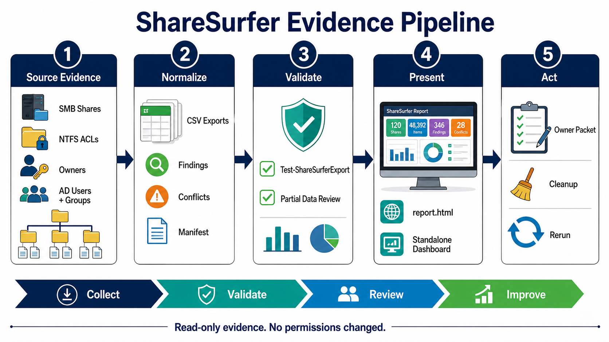
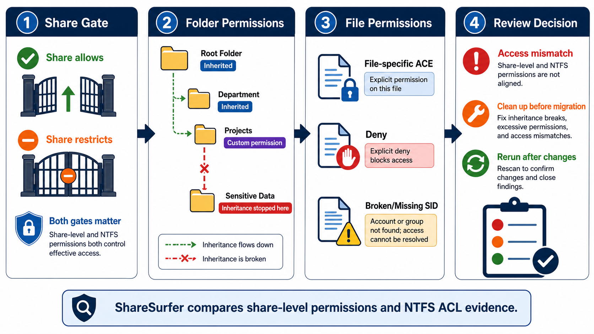
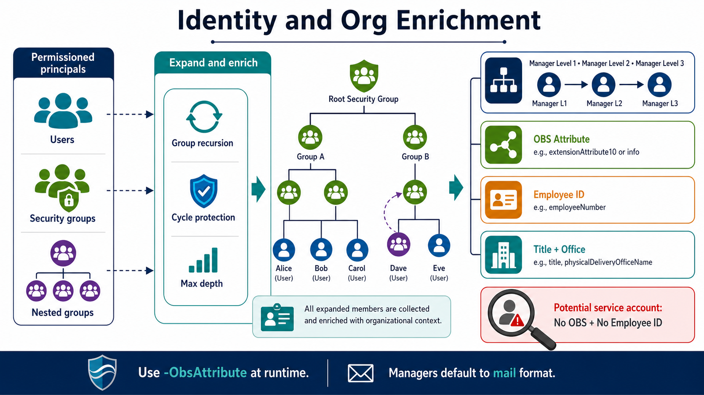
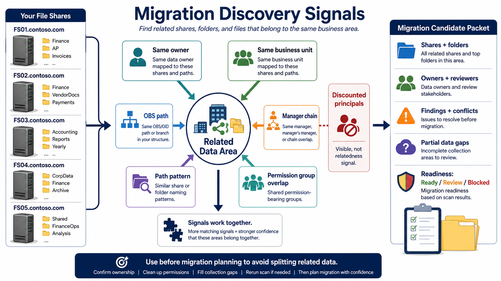
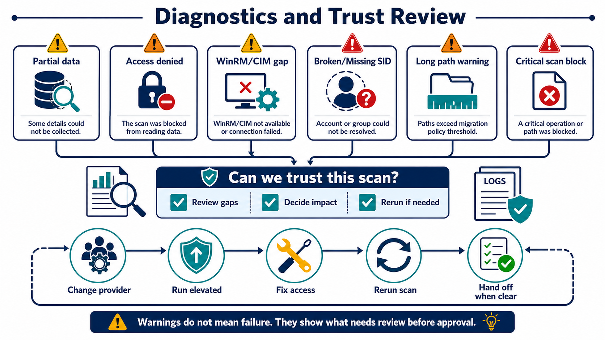
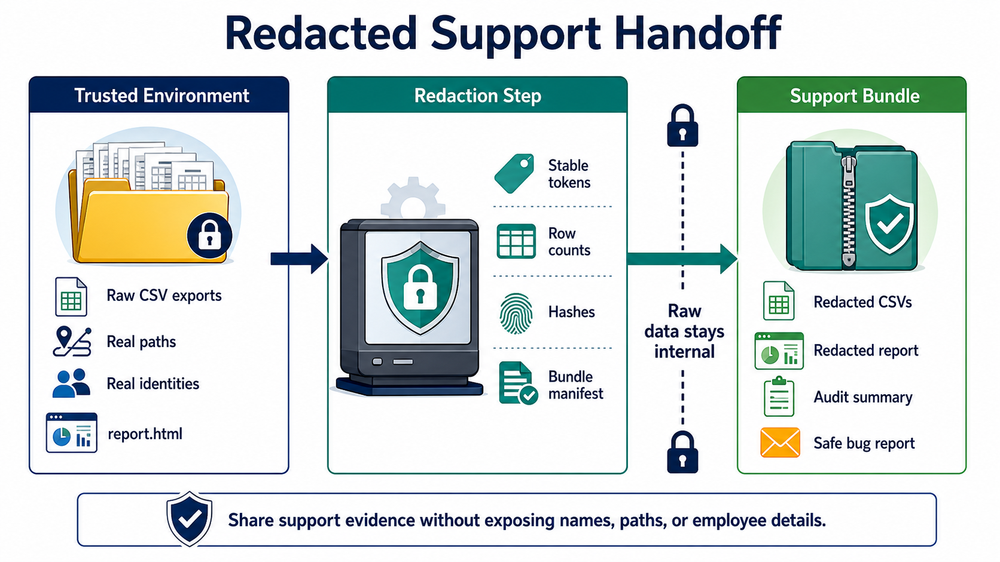
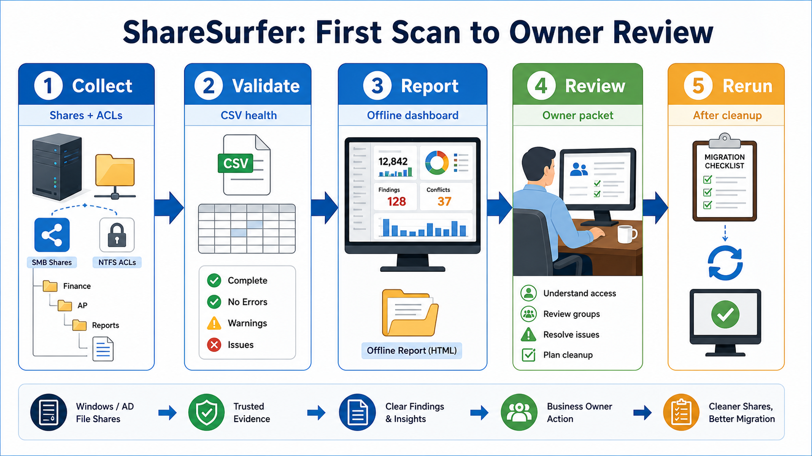
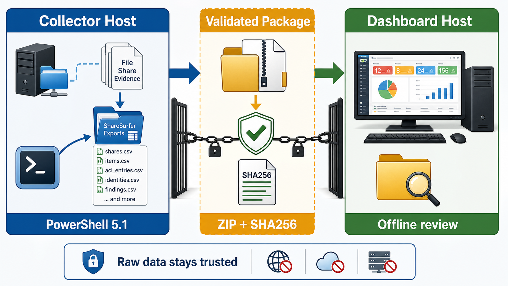
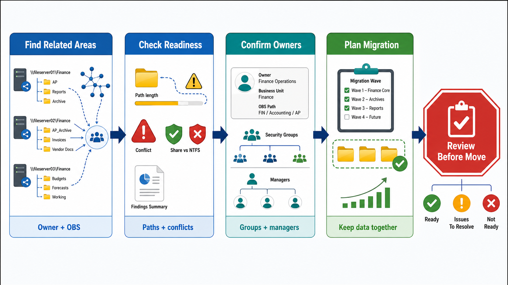

# ShareSurfer

ShareSurfer helps business units understand complex Windows file-share access by collecting share permissions, filesystem ACLs, ownership, inheritance state, identity enrichment, group expansion, org context, and migration-readiness findings.

V1 is PowerShell-first and designed for airgapped or tightly controlled environments:

- PowerShell 5.1 module layout under `src/ShareSurfer`
- Normalized CSV export set for Excel, Power BI, and downstream analysis
- Dynamic offline HTML report with no server or internet dependency
- Windows/AD lab fixture planning and live fixture creation on Windows hosts
- Raw export validation plus redacted support bundle generation

## How ShareSurfer Works

Think of ShareSurfer as a read-only evidence pipeline for file-share review. It does not change permissions, approve access, or migrate data. It collects what exists, normalizes it, enriches it with identity and org context, then gives operators and business owners safer ways to review the results.

In ShareSurfer, **Owner** means the mapped business or data reviewer for a share, folder, or group of related paths. That is separate from the Windows NTFS owner field collected in `items.csv`.

### 1. Evidence moves from shares into review outputs



The collector reads share permission evidence, file and folder ACLs, owner values, inheritance state, AD identities, groups, and org attributes. The output is a normalized evidence set: CSVs, findings, conflicts, `scan_manifest.csv`, `report.html`, and optional standalone dashboard files.

### 2. Share access and file/folder access are both reviewed



The share permission is the front gate. NTFS permissions decide what happens after someone gets through that gate. ShareSurfer shows both layers so reviewers can spot restrictive share gates, NTFS deny collisions, broken inheritance, deep custom permissions, missing SIDs, and long-path migration warnings.

### 3. Identities become reviewable org context



ShareSurfer expands permission-bearing security groups, follows nested membership with cycle protection, enriches users with employee and directory attributes, follows manager chains up to three levels, and records the runtime OBS/OID attribute selected with `-ObsAttribute`.

### 4. Related data areas are grouped for migration planning



Migration Discovery helps avoid moving one part of a business data area while leaving related paths behind. It groups related shares and folders using explainable signals such as owner mapping, business unit, OBS path, manager chain, path naming, and permission-group overlap. Discounted admin or HelpDesk principals remain visible, but they do not inflate relatedness.

### 5. Diagnostics explain how much to trust the scan



Warnings do not always mean the scan failed. They tell the operator what needs review before asking owners to approve anything: access denied paths, WinRM/CIM gaps, partial share evidence, broken or missing SIDs, critical scan information blocks, and paths that may need a rerun with different rights or a different provider.

### 6. Support evidence can be redacted before handoff



Raw exports can contain real identities, paths, employee attributes, manager context, and business structure. When evidence must leave trusted handling, create a redacted support bundle so troubleshooting shape, row counts, manifests, and stable tokens can be shared without exposing the raw dataset.

The deeper [visual field guide](docs/visual-field-guide.md) explains each diagram with review questions and primary output files.

## Commands

- `New-ShareSurferLabFixture`
- `Invoke-ShareSurferScan`
- `Invoke-ShareSurferOpenFileAssessment`
- `Invoke-ShareSurferPortProtocolAssessment`
- `ConvertTo-ShareSurferReport`
- `New-ShareSurferSupportBundle`
- `Test-ShareSurferExport`

## Basic Use Cases

ShareSurfer is useful when access data is too complex for business owners to review directly from Windows tools.

| Use case | Start here | Output to review |
| --- | --- | --- |
| First business-owner review | Scan one known share with owner mapping | `owner_review_packets.csv`, `owner_risk_pivots.csv`, and `report.html` |
| Migration discovery | Scan related shares with file/folder evidence and owner mappings | `related_data_areas.csv`, long-path findings, inheritance breaks, and share-vs-NTFS conflicts |
| Hot folder activity review | Add an open-file assessment after the scan | `open_file_summary.csv`, `open_file_samples.csv`, and dashboard Raw Evidence Tables |
| Port and protocol readiness | Run a port/protocol assessment before packaging the dashboard | `port_protocol_targets.csv`, `port_protocol_checks.csv`, and dashboard Ports & Protocols |
| Nonpermissive collector workflow | Collect on a locked-down Windows host, then transfer the validated dataset to a dashboard host | Validated CSV export folder, `report.html`, optional standalone dashboard folder |
| Broad admin or HelpDesk access cleanup | Provide a discounted principals CSV | Visible access evidence that does not inflate Migration Discovery relatedness |
| Support or bug report | Create a redacted support bundle after export validation | Stable-token CSVs, manifests, and optional redacted report |

## Workflow Guides

These diagrams show the normal ShareSurfer paths at a glance. Use the [workflow guide](docs/workflow-guides.md) when you need the step-by-step version with commands, handoff checks, and stop gates.

For a richer explanation of the evidence pipeline, access model, identity enrichment, migration discovery, diagnostics, and redacted support handoff, use the [visual field guide](docs/visual-field-guide.md).

### First Scan to Owner Review



Use this flow when a team is scanning one share or a small set of related shares for the first business-owner review. The important outputs are the validated CSV folder, `report.html`, the standalone dashboard package, `owner_review_packets.csv`, and the list of findings that should be cleaned up before a migration wave.

### Locked-Down Collector to Dashboard Host



Use this flow when collection must happen on a restricted Windows host but review can happen somewhere else. The collector creates evidence, `Test-ShareSurferExport` validates it, the transfer package gets a SHA256 hash, and the dashboard host opens `report.html` or `standalone-dashboard\index.html` without needing access to the file shares.

### Migration Discovery and Cleanup Planning



Use this flow before migration planning to keep related data together. ShareSurfer groups evidence by owner, business unit, OBS path, manager chain, path patterns, security groups, long-path warnings, inheritance breaks, share-vs-NTFS conflicts, partial collection gaps, and discounted access principals.

## Nonpermissive / Two-Host Operation

Many ShareSurfer runs will happen in environments where the collector host is intentionally limited: no internet access, no npm, no browser tooling, and no elevated dashboard workstation behavior. That is fine. The collector only needs Windows PowerShell 5.1, the ShareSurfer module, read access to the target shares, and directory read access for identity enrichment.


Keep these roles separate:

- **Collector host:** runs `Invoke-ShareSurferScan`, reads SMB/share/ACL/owner/inheritance data, enriches identities from AD or LDAP, and writes the normalized export folder.
- **Validation step:** runs `Test-ShareSurferExport`, reviews partial-data warnings, and confirms the selected OBS attribute, depth thresholds, and path policy.
- **Transfer package:** compresses the validated export folder and records a SHA256 hash before the data leaves the restricted environment.
- **Dashboard host:** opens `report.html` or a packaged standalone dashboard from the exported dataset. It does not need rights to rescan the file shares.
- **Support path:** if anything leaves trusted handling for support, use a redacted support bundle instead of raw CSVs.

The most common production pattern is two-host review:


1. Run the collector inside the restricted file-share environment.
2. Validate the raw CSV export set.
3. Package the export folder and move it by an approved transfer process.
4. Open `report.html` or package the standalone dashboard on a more permissive review workstation.

See the [nonpermissive collector to dashboard host workflow](docs/nonpermissive-collection-dashboard-workflow.md) for a full walkthrough.

## Quick Start

For a first-time walkthrough, start with the [First-run guide](docs/first-run-guide.md). It explains prerequisites, target selection, collector commands, CSV outputs, reports, and redacted support bundles for operators who are new to ShareSurfer or new to Windows file-share auditing.

Choose the starting path that matches your situation:

| Situation | Use this path |
| --- | --- |
| You are new to ShareSurfer | Follow the [First-run guide](docs/first-run-guide.md) from the beginning. |
| You need plain-English definitions | Use the [glossary](docs/glossary.md). |
| Your collector host is locked down | Use the [nonpermissive collector to dashboard host workflow](docs/nonpermissive-collection-dashboard-workflow.md). |
| You want copy/paste commands for common tasks | Use the [command recipes](docs/command-recipes.md). |
| A scan completed but looks partial, sparse, or confusing | Use the [first-run troubleshooting guide](docs/first-run-troubleshooting.md) before asking a business owner to approve the result. |
| You are ready to send results to a business owner | Use the [business review handoff guide](docs/business-review-handoff.md). |
| You need CSV definitions or joins | Use the [export schema](docs/export-schema.md). |
| You are validating the enterprise lab | Use the [operator workflow](docs/operator-workflow.md) and [Windows lab readiness checklist](docs/windows-lab-readiness-checklist.md). |

Current pre-release quickstart package: [v0.1.0-pre.9](https://github.com/jonathanweinberg/ShareSurfer/releases/tag/v0.1.0-pre.9). Download `ShareSurfer-0.1.0-pre.9.zip` and `ShareSurfer-0.1.0-pre.9.zip.sha256` from that release on an approved connected workstation, verify or record the SHA256 value, then move the zip by your normal approved process. The package is unsigned, but it is fully built and includes the PowerShell module, scripts, documentation, release manifest, dependency-age report, SHA256 files, and prebuilt standalone dashboard template assets.

When the ZIP is extracted to `C:\ShareSurfer\`, the release root is:

```text
C:\ShareSurfer\ShareSurfer-0.1.0-pre.9\
```

If Windows Explorer suggests extracting to `C:\ShareSurfer\ShareSurfer-0.1.0-pre.9`, change the destination to `C:\ShareSurfer` to avoid a doubled folder such as `C:\ShareSurfer\ShareSurfer-0.1.0-pre.9\ShareSurfer-0.1.0-pre.9`. From PowerShell, use:

```powershell
$releaseZip = 'C:\ShareSurfer\downloads\ShareSurfer-0.1.0-pre.9.zip'
$releaseRoot = 'C:\ShareSurfer\ShareSurfer-0.1.0-pre.9'

Expand-Archive -LiteralPath $releaseZip -DestinationPath 'C:\ShareSurfer' -Force
Get-ChildItem -Path "$releaseRoot\*" -Recurse -File -Include *.ps1,*.psm1,*.psd1 | Unblock-File
Test-Path "$releaseRoot\src\ShareSurfer\ShareSurfer.psd1"
Test-Path "$releaseRoot\interface\standalone-dashboard\dist\index.html"
```

The `Unblock-File` line clears the Windows downloaded-file block from ShareSurfer PowerShell files. It is safe to run again after re-extracting the release ZIP.

On Windows, release users do not need Node, npm, Vite, a preview server, or internet access to package and open the standalone dashboard. Use Windows PowerShell 5.1 (`powershell.exe`) for the collector and dashboard packager unless your workstation already has PowerShell 7 (`pwsh`).

`Invoke-ShareSurferScan` prints timestamped phase updates while it runs so operators can see collection, owner mapping, identity enrichment, export, and completion progress. At the end, look for the `ShareSurfer Summary` lines. They show the scan counts, output path, any partial-data or collection-gap warning, and the next `Test-ShareSurferExport` command. Add `-Quiet` only for automation where console progress is not wanted.

```powershell
$releaseRoot = 'C:\ShareSurfer\ShareSurfer-0.1.0-pre.9'
$exportPath = 'C:\ShareSurfer\exports\scan-001'
$inputRoot = 'C:\ShareSurfer\inputs'
$ownerMappingPath = Join-Path $inputRoot 'owner-mapping.csv'
$discountedPrincipalPath = Join-Path $inputRoot 'discounted-principals.csv'

Set-Location $releaseRoot
Import-Module "$releaseRoot\src\ShareSurfer\ShareSurfer.psd1" -Force

New-Item -ItemType Directory -Force -Path $inputRoot | Out-Null

@(
  [pscustomobject]@{
    Pattern = '\\files01\Finance*'
    Owner = 'Finance Operations'
    BusinessUnit = 'Finance'
    Source = 'quickstart'
  }
) | Export-Csv -LiteralPath $ownerMappingPath -NoTypeInformation -Encoding UTF8

$scanParams = @{
  TargetPath = '\\files01\Finance'
  OutputPath = $exportPath
  ObsAttribute = 'extensionAttribute10'
  ManagerIdentityFormat = 'MailTo'
  AdLookupMode = 'Auto'
}

if (Test-Path -LiteralPath $ownerMappingPath) {
  $scanParams.OwnerMappingPath = $ownerMappingPath
}

if (Test-Path -LiteralPath $discountedPrincipalPath) {
  $scanParams.DiscountedPrincipalPath = $discountedPrincipalPath
}

Invoke-ShareSurferScan @scanParams

Invoke-ShareSurferOpenFileAssessment `
  -ComputerName 'files01' `
  -ShareName 'Finance' `
  -OutputPath $exportPath `
  -SampleCount 1

Invoke-ShareSurferPortProtocolAssessment `
  -ComputerName 'files01' `
  -ShareName 'Finance' `
  -OutputPath $exportPath

Test-ShareSurferExport -ExportPath $exportPath
ConvertTo-ShareSurferReport -ExportPath $exportPath -OutputPath "$exportPath\report.html"

powershell.exe -NoLogo -NoProfile -ExecutionPolicy Bypass -File "$releaseRoot\scripts\New-ShareSurferStandaloneDashboard.ps1" `
  -ExportPath $exportPath `
  -OutputPath "$exportPath\standalone-dashboard" `
  -Force

Start-Process "$exportPath\standalone-dashboard\index.html"
New-ShareSurferSupportBundle -ExportPath $exportPath -OutputPath 'C:\ShareSurfer\support\scan-001-redacted'
```

`owner_review_packets.csv` is generated by the scan. You do not create it by hand; create or update `owner-mapping.csv`, run `Invoke-ShareSurferScan`, then review `$exportPath\owner_review_packets.csv`.

`Invoke-ShareSurferOpenFileAssessment` is optional. It records open-file activity into `open_file_manifest.csv`, `open_file_samples.csv`, `open_file_summary.csv`, and `open_file_errors.csv` in the same export folder. Use a one-sample quick run for ad hoc checks, or increase `-SampleCount` and `-IntervalSeconds` for a longer observation window. The assessment helps identify hot folders by repeated open-file observations; it is activity evidence, not a replacement for share and NTFS permission evidence.

`Invoke-ShareSurferPortProtocolAssessment` is optional. It records collector host context and read-only reachability checks into `port_protocol_manifest.csv`, `port_protocol_targets.csv`, and `port_protocol_checks.csv`. The standalone dashboard shows those rows in **Ports & Protocols** below Raw Evidence. A failed WinRM/CIM check is not automatically fatal; it usually means ShareSurfer may need SMB/native fallback or may mark share-level metadata partial. A passed SMB/RPC check proves the network route is reachable; it does not prove the collector account can read or parse share security descriptors, owner values, or folder/file DACLs. The assessment also writes operator guidance fields that explain the likely collection impact, suggested next action, and remediation hint for common SMB, WinRM/CIM, RPC, and directory protocol results.

Run the collector from an elevated Windows PowerShell prompt when possible. Without an elevated/admin token, ShareSurfer may miss or partially record share-level permission proof, protected ACLs, owner values, denied folders/files, and security descriptor details that require higher privileges. The scan keeps going best-effort and records those gaps as partial data, collection errors, and critical scan information blocks.

In ShareSurfer, **Owner** means the mapped business/data reviewer. It is separate from the NTFS owner value in `items.csv`. A blank item owner usually means the owner value could not be read or resolved; it is not proof that the file has no real Windows owner.

### Quick Start in a Nonpermissive Environment

Use this path when the collector host cannot use internet access, npm, browser tooling, or a dashboard preview server. Prefer the [v0.1.0-pre.9 release zip](https://github.com/jonathanweinberg/ShareSurfer/releases/tag/v0.1.0-pre.9) for first-time Windows use because it already includes the built dashboard assets. Copy the unpacked ShareSurfer release folder to the collector host first. If the ZIP is extracted to `C:\ShareSurfer\`, use `C:\ShareSurfer\ShareSurfer-0.1.0-pre.9` as `$shareSurferRoot`. The collector only needs PowerShell 5.1, read access to the target share, and directory read access for identity enrichment.

```powershell
$shareSurferRoot = 'C:\ShareSurfer\ShareSurfer-0.1.0-pre.9'
$exportPath = 'C:\ShareSurfer\exports\scan-001'
$handoffPath = 'C:\ShareSurfer\handoff\scan-001.zip'
$inputRoot = 'C:\ShareSurfer\inputs'
$ownerMappingPath = Join-Path $inputRoot 'owner-mapping.csv'
$discountedPrincipalPath = Join-Path $inputRoot 'discounted-principals.csv'

New-Item -ItemType Directory -Force -Path (Split-Path -Path $exportPath) | Out-Null
New-Item -ItemType Directory -Force -Path (Split-Path -Path $handoffPath) | Out-Null
New-Item -ItemType Directory -Force -Path $inputRoot | Out-Null

Import-Module "$shareSurferRoot\src\ShareSurfer\ShareSurfer.psd1" -Force

$scanParams = @{
  TargetPath = '\\files01\Finance'
  OutputPath = $exportPath
  ObsAttribute = 'extensionAttribute10'
  ManagerIdentityFormat = 'MailTo'
  AdLookupMode = 'Auto'
}

if (Test-Path -LiteralPath $ownerMappingPath) {
  $scanParams.OwnerMappingPath = $ownerMappingPath
}

if (Test-Path -LiteralPath $discountedPrincipalPath) {
  $scanParams.DiscountedPrincipalPath = $discountedPrincipalPath
}

Invoke-ShareSurferScan @scanParams

Test-ShareSurferExport -ExportPath $exportPath
ConvertTo-ShareSurferReport -ExportPath $exportPath -OutputPath "$exportPath\report.html"

powershell.exe -NoLogo -NoProfile -ExecutionPolicy Bypass -File "$shareSurferRoot\scripts\New-ShareSurferStandaloneDashboard.ps1" `
  -ExportPath $exportPath `
  -OutputPath "$exportPath\standalone-dashboard" `
  -Force

Compress-Archive -Path "$exportPath\*" -DestinationPath $handoffPath -Force
Get-FileHash -Algorithm SHA256 -Path $handoffPath
```

If you do not have owner mappings or discounted principals yet, leave those CSV files absent. The splatted command above only passes them when the files exist. Move the handoff zip file and SHA256 hash through your approved transfer process, then open `report.html` or `standalone-dashboard\index.html` on the dashboard host. Do not send raw CSVs outside trusted handling; use `New-ShareSurferSupportBundle` for support cases.

If WinRM/CIM is blocked or the target is a non-Windows SMB service, ShareSurfer continues best-effort and records the missing share-level permission proof as partial-data evidence in `collection_errors.csv`, `findings.csv`, and `scan_events.csv`.

When the collector host is Windows and WinRM/CIM is blocked, you can scan explicit SMB shares with the native provider instead of the default PowerShell/CIM route:

```powershell
Invoke-ShareSurferScan `
  -ComputerName 'files01' `
  -ShareName 'Finance' `
  -SmbCollectionProvider NativeSmbRpc `
  -OutputPath $exportPath `
  -ObsAttribute 'extensionAttribute10' `
  -ManagerIdentityFormat MailTo
```

`NativeSmbRpc` uses Windows SMB/RPC and Win32 security APIs for share metadata, share permissions, owner values, and DACL evidence. It does not require WinRM/CIM, `Get-SmbShare`, `Get-SmbShareAccess`, or `Get-Acl` for that provider path. It is still permission-dependent: access denied, unavailable share security descriptors, unparseable security descriptors, or unreadable folders/files are recorded as partial data and collection errors. If port checks pass but the scan reports `NativeShareSecurityDescriptorUnavailable`, `NativeShareSecurityDescriptorParseFailed`, `NativeSecurityDescriptorReadFailed`, or `NativeSecurityDescriptorParseFailed`, treat the scan as reachable but incomplete until the permissions or SMB server behavior are reviewed.

To keep broad operational access visible without letting it drive Migration Discovery, pass a discounted principal CSV:

```powershell
Invoke-ShareSurferScan -TargetPath '\\files01\Finance' -OutputPath $exportPath -DiscountedPrincipalPath 'C:\ShareSurfer\inputs\discounted-principals.csv'
```

The CSV must include `Identity` and can include `Reason` and `Scope`. Discounted means visible access evidence that is not used for migration relatedness; it does not mean ignored, safe, approved, or remediated.

## Standalone Dashboard

ShareSurfer also includes a React/Vite standalone dashboard for richer local review. Release packages include the built dashboard assets under `interface/standalone-dashboard/dist`, so a release user can package and open dashboard output from `index.html` on Windows or macOS without npm, Vite, a development server, or internet access.

The dashboard files included in the release are template assets. Opening `interface\standalone-dashboard\dist\index.html` directly from the release shows a template/onboarding screen, not demo data. To review real scan results, package a validated export folder with `scripts\New-ShareSurferStandaloneDashboard.ps1`; the generated `standalone-dashboard\index.html` is the one business reviewers should open.

Package a validated export folder as a standalone dashboard from the release zip on Windows:

```powershell
$releaseRoot = 'C:\ShareSurfer\ShareSurfer-0.1.0-pre.9'

powershell.exe -NoLogo -NoProfile -ExecutionPolicy Bypass -File "$releaseRoot\scripts\New-ShareSurferStandaloneDashboard.ps1" `
  -ExportPath $exportPath `
  -OutputPath "$exportPath\standalone-dashboard" `
  -Force

Start-Process "$exportPath\standalone-dashboard\index.html"
```

Development maintainers can still run the dashboard locally from source:

```powershell
npm --prefix interface/standalone-dashboard run dev
```

Build the static dashboard assets from source:

```powershell
npm --prefix interface/standalone-dashboard run build
```

Package a validated export folder as a standalone dashboard with PowerShell 7:

```powershell
pwsh -NoLogo -NoProfile -File scripts/New-ShareSurferStandaloneDashboard.ps1 `
  -ExportPath $exportPath `
  -OutputPath "$exportPath\standalone-dashboard" `
  -Force
```

Open `standalone-dashboard\index.html` on Windows or `standalone-dashboard/index.html` on macOS. The package uses relative assets and `sharesurfer-data.js`, so it can be copied, zipped, or opened directly from disk.

On the dashboard Overview tab, use **Key Terms** for plain-English definitions of Owner, No owner, Broken/Missing SID, Collection error, Partial data, Discounted access principal, and Critical scan information block.

Current standalone dashboard examples are preserved under [docs/visuals/dashboard-screenshots/2026-06-09-current](docs/visuals/dashboard-screenshots/2026-06-09-current/README.md). Use that dated set when you want to show the richer standalone dashboard views, including ad-hoc table filtering, sidebar collapse, path context, Migration Discovery selector filtering, Permissioned Group Review, and local review decisions.

A future signed Windows dashboard viewer can wrap this same static dashboard package without changing the collector or export format. See the [WebView2 dashboard viewer concept](docs/webview2-dashboard-viewer.md) for the proposed executable wrapper, trust model, and release path.

## Pre-1.0 Release Packaging

The first ShareSurfer release packages are unsigned but fully built. The current quickstart release is [v0.1.0-pre.9](https://github.com/jonathanweinberg/ShareSurfer/releases/tag/v0.1.0-pre.9). It includes the PowerShell module, scripts, documentation, SHA256 hash files, a dependency-age report, a release manifest, and prebuilt standalone dashboard template assets. The release manifest records `signingStatus` as `UnsignedPre1.0` so operators can distinguish this basic package from a future signed release.

Release packaging enforces a dependency-age policy for npm packages by default: package versions must be at least 7 days old before they are included in a release package. This helps avoid pulling a just-published dependency into a pre-release. Local dry runs can use `-SkipDependencyAgeCheck`, but tagged release packaging should keep the check enabled.

Build a local unsigned pre-1.0 package:

```powershell
pwsh -NoLogo -NoProfile -File scripts/New-ShareSurferRelease.ps1 `
  -OutputRoot .\artifacts `
  -Force
```

Release output is written to `artifacts\ShareSurfer-<version>\`, `artifacts\ShareSurfer-<version>.zip`, and `artifacts\ShareSurfer-<version>.zip.sha256`. After unpacking the zip, the prebuilt dashboard template assets are available at `interface/standalone-dashboard/dist`, and `scripts\New-ShareSurferStandaloneDashboard.ps1` can use them without npm, Vite, a server, or internet access to package a real export dashboard.

## Lab Fixture

Plan the lab first:

```powershell
New-ShareSurferLabFixture -OutputPlanOnly -RootPath 'C:\ShareSurferLab' -DomainNetBiosName 'CONTOSO' -ObsAttribute 'extensionAttribute10'
```

On a disposable Windows/AD lab host, rerun without `-OutputPlanOnly` to create the filesystem/share fixtures and, when the ActiveDirectory module is available, demo users, groups, manager chains, employee fields, and OBS extension attributes. The lab plan includes directory ACLs, file-specific ACLs, ownership examples, broken inheritance, deep explicit ACEs, long-path fixtures, NTFS deny examples, and share-vs-NTFS conflict cases.

Enterprise validation should use the scaled profile:

```powershell
New-ShareSurferLabFixture -OutputPlanOnly -RootPath 'C:\ShareSurferEnterpriseLab' -Scale Enterprise -EnterpriseUserCount 2500 -EnterpriseShareCount 250 -EnterpriseFilesPerShare 8
```

The enterprise profile is designed for a multi-thousand user population, hundreds of SMB shares, deep folder trees with real small files throughout, and an estimated lab data footprint under the default 2 GiB generated file-data budget. An 8 GiB budget is reserved for explicit stress runs. Final enterprise validation should run `scripts\Invoke-ShareSurferLabValidation.ps1` with `-RequireLiveEvidence` so required proof points cannot pass on plan-only rows.

## Azure Files Path Policy

ShareSurfer separates Azure Files hard limits from migration policy warnings. Microsoft documents 255-character path components and 2,048-character full paths for Azure Files. ShareSurfer defaults to flagging full paths over 256 characters as an operational migration warning, not as proof that Azure Files cannot store the path.

## Documentation

- [Operator workflow](docs/operator-workflow.md)
- [First-run guide](docs/first-run-guide.md)
- [Glossary](docs/glossary.md)
- [First-run troubleshooting](docs/first-run-troubleshooting.md)
- [Business review handoff](docs/business-review-handoff.md)
- [Management overview](docs/management-overview.md)
- [Offline management overview slide](docs/management-overview.html)
- [Visual field guide](docs/visual-field-guide.md)
- [Workflow guide](docs/workflow-guides.md)
- [Command recipes](docs/command-recipes.md)
- [Nonpermissive collector to dashboard host workflow](docs/nonpermissive-collection-dashboard-workflow.md)
- [Standalone dashboard interface spec](docs/standalone-dashboard-interface-spec.md)
- [WebView2 dashboard viewer concept](docs/webview2-dashboard-viewer.md)
- [V1 phase-1 acceptance audit](docs/v1-phase1-acceptance-audit.md)
- [Export schema](docs/export-schema.md)
- [Azure Files path policy](docs/azure-files-path-policy.md)
- [Redacted support bundles](docs/redacted-support-bundles.md)
- [Scaled lab generator spec](docs/scaled-lab-generator-spec.md)
- [Windows lab readiness checklist](docs/windows-lab-readiness-checklist.md)
- [Workflow visuals](docs/workflow-visuals.md)

## Tests

The default test runner avoids external dependencies so it can run on a fresh collector workstation:

```powershell
pwsh -NoLogo -NoProfile -File tests/Invoke-ShareSurferTests.ps1
```

If Pester is installed, you can use the Pester-compatible wrapper:

```powershell
pwsh -NoLogo -NoProfile -File scripts/Invoke-ShareSurferPester.ps1
```
