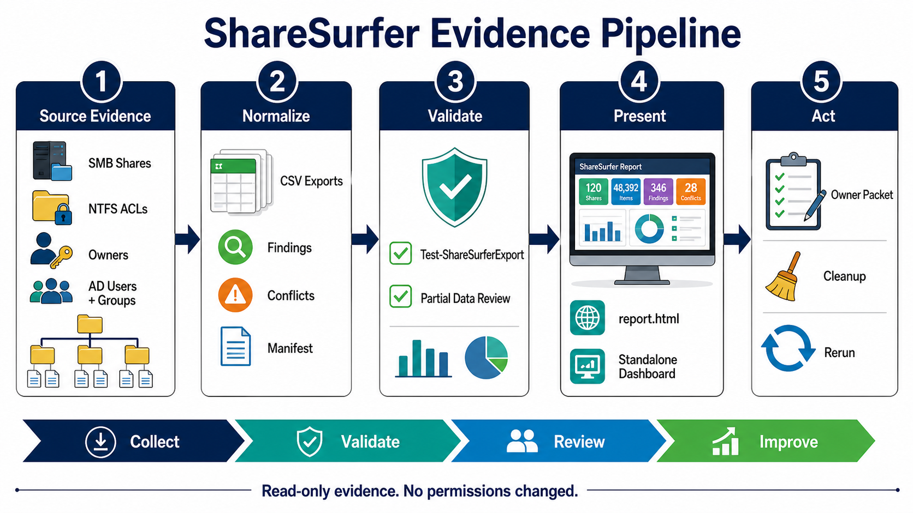
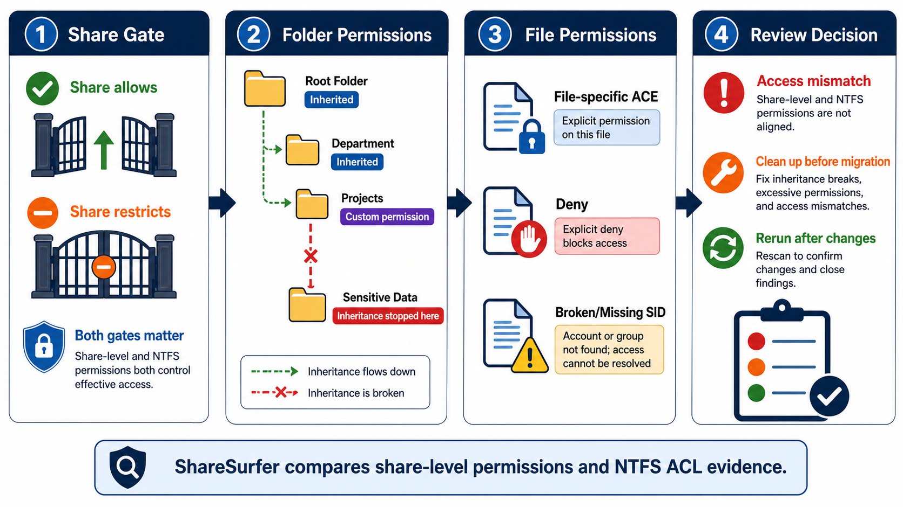
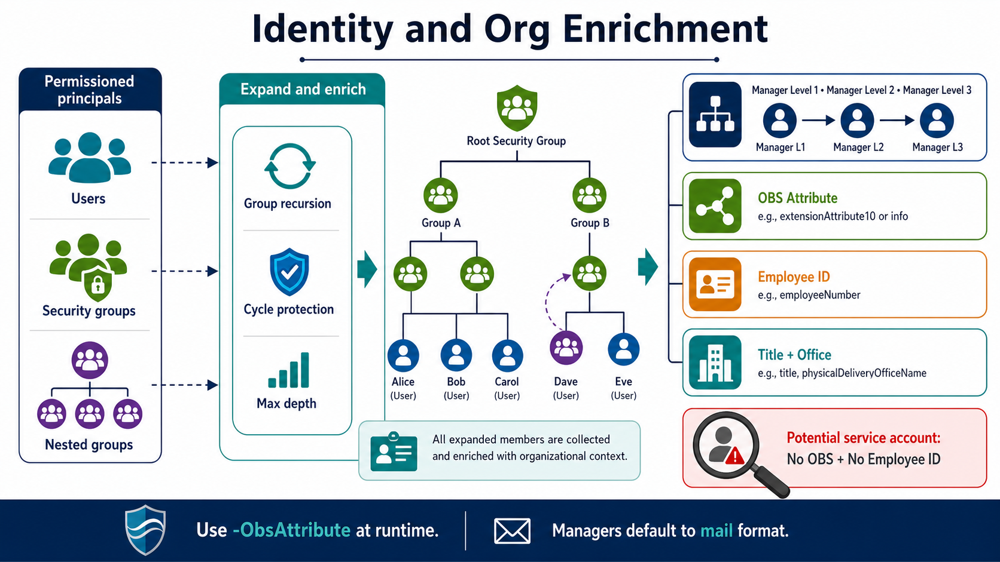
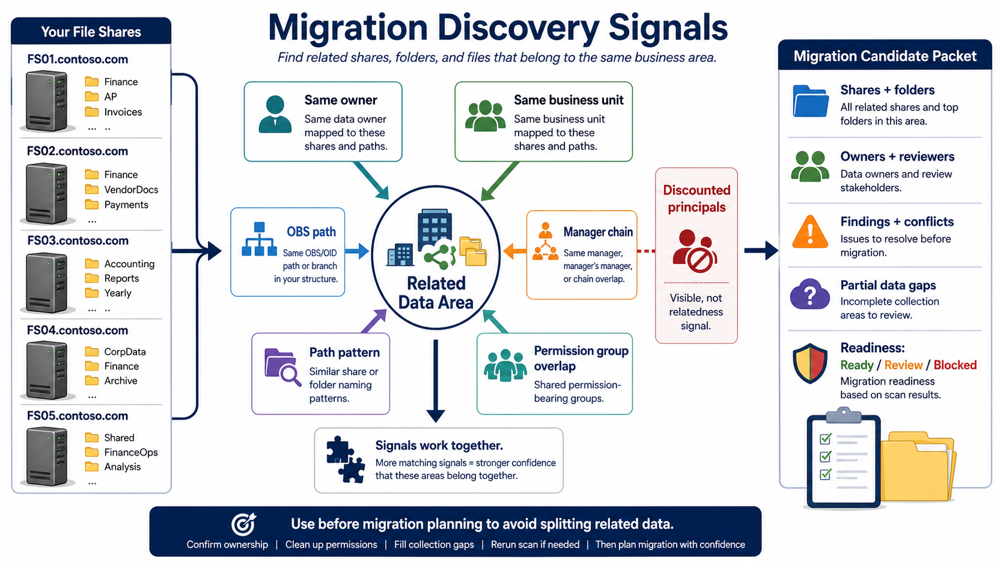
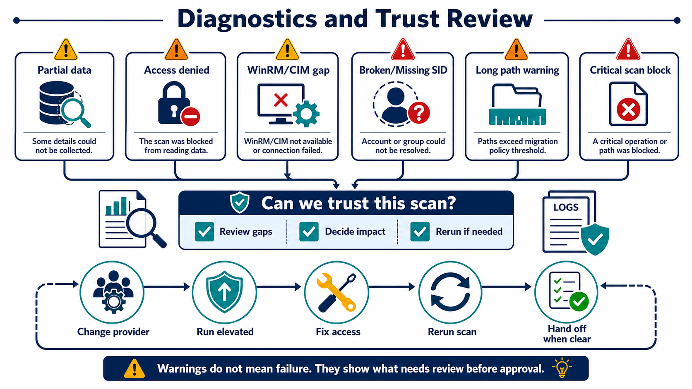
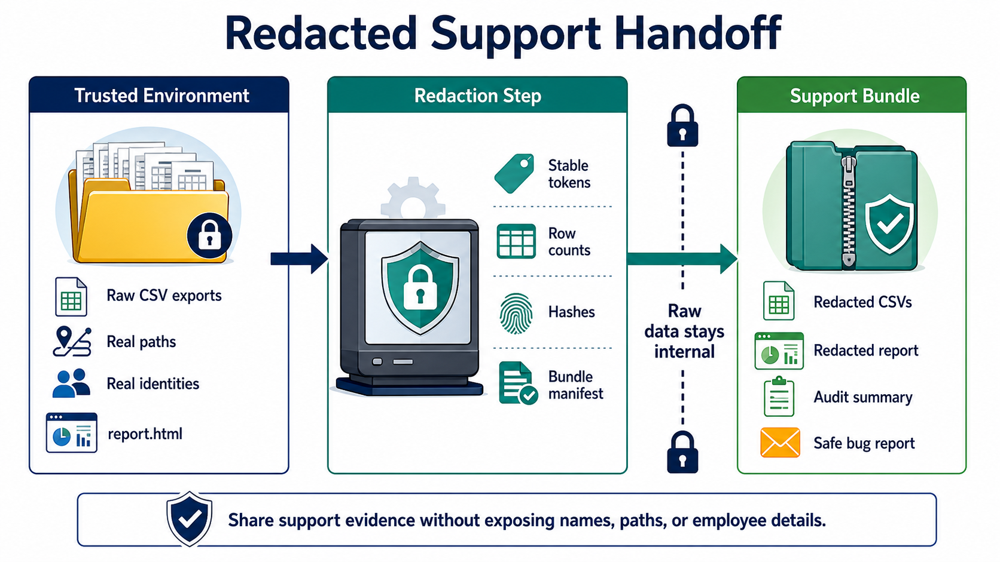
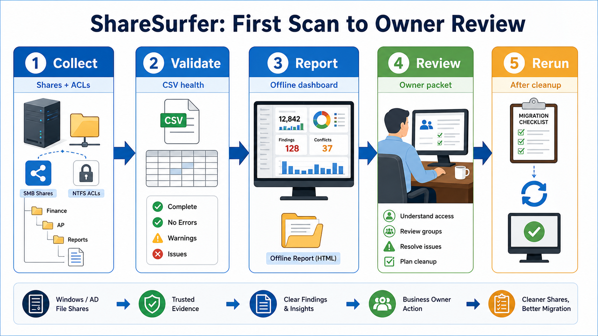
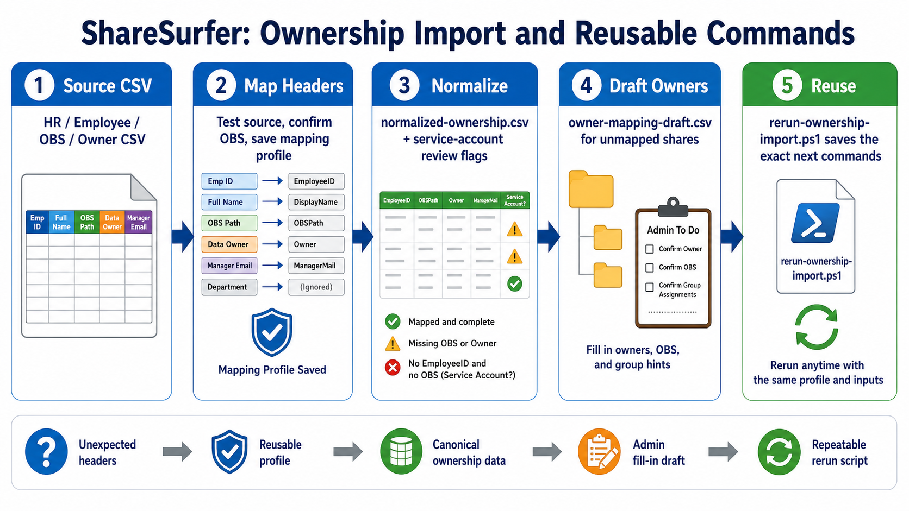
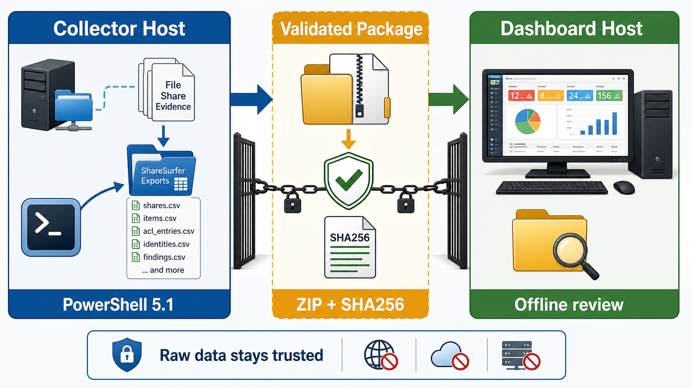
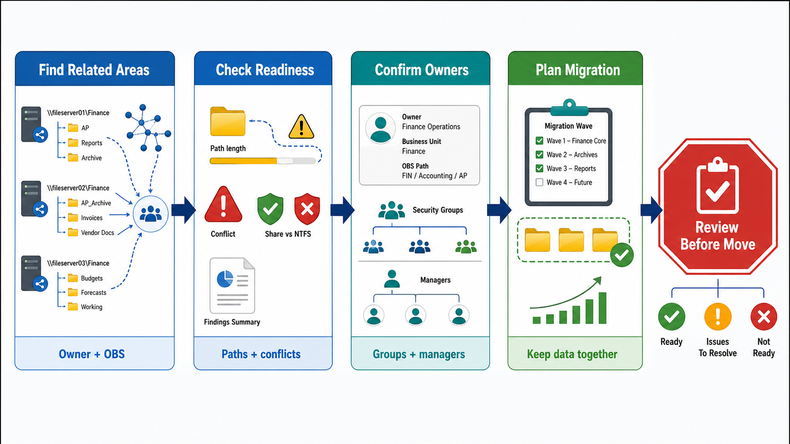

# ShareSurfer

ShareSurfer is a read-only PowerShell-first toolkit for making complex Windows file-share access understandable. It collects share permissions, filesystem ACLs, ownership, inheritance state, identity/group context, org attributes, and migration-readiness findings into CSVs, reports, and an offline dashboard.

It is built for controlled environments:

- PowerShell 5.1 collector module under `src/ShareSurfer`
- Normalized CSV exports for Excel, Power BI, and downstream review
- Offline `report.html` plus optional packaged standalone dashboard
- Windows/AD lab fixtures for repeatable validation
- Export validation and redacted support bundles

## How ShareSurfer Works

ShareSurfer does not change permissions, approve access, or migrate data. It collects evidence, normalizes it, enriches it, and gives operators and business owners safer ways to review the current state.

In ShareSurfer, **Owner** means the mapped business or data reviewer for a share, folder, or group of related paths. That is separate from the Windows NTFS owner field in `items.csv`.

| Step | What happens | Visual |
| --- | --- | --- |
| Evidence pipeline | Share, ACL, owner, inheritance, identity, and finding evidence becomes normalized outputs. |  |
| Share gate plus NTFS | Share permissions and file/folder ACLs are reviewed together. |  |
| Identity context | Groups expand, members enrich, manager chains are followed, and `-ObsAttribute` records OBS/OID context. |  |
| Migration Discovery | Related shares and folders are grouped by owner, business unit, OBS, manager chain, paths, and group overlap. |  |
| Trust review | `evidence_confidence.csv` and diagnostics explain partial data, provider fallback, and rerun needs. |  |
| Safe support handoff | Redacted support bundles preserve troubleshooting shape without exposing raw identities and paths. |  |

For the fuller explanation, use the [visual field guide](docs/visual-field-guide.md).

## Start Here

For the first real run:

1. Download `ShareSurfer-0.1.0-pre.38.zip` and its SHA256 file from the [current prerelease](https://github.com/jonathanweinberg/ShareSurfer/releases/tag/v0.1.0-pre.38). If that tag is not visible, use the latest published prerelease and substitute its version in the paths below.
2. Extract to `C:\` so the release root is `C:\ShareSurfer-0.1.0-pre.38\`.
3. Recursively unblock extracted PowerShell files:

   ```powershell
   $releaseRoot = 'C:\ShareSurfer-0.1.0-pre.38'
   Get-ChildItem -LiteralPath $releaseRoot -Recurse -File |
     Where-Object { $_.Extension -in '.ps1', '.psm1', '.psd1' } |
     Unblock-File
   ```

   This is the cleanest no-prompt path. If you skip this and run `.\Start-ShareSurfer.ps1` directly, Windows may still show one prompt for the launcher because the launcher cannot unblock itself before it starts. After you choose **Run once**, the launcher attempts the same recursive unblock before importing the module.

4. For the guided startup path, run the release-root launcher:

   ```powershell
   powershell.exe -NoLogo -NoProfile -ExecutionPolicy Bypass -File "$releaseRoot\Start-ShareSurfer.ps1" -Force
   ```

   It recursively unblocks ShareSurfer PowerShell files, imports the module, and opens the **ShareSurfer Start Menu**. In a normal PowerShell ConsoleHost it uses arrow-key selection; redirected or locked-down consoles automatically fall back to numbered prompts, and you can force that behavior with `-ConsoleMode Plain`. From the menu you can review readiness, build ownership inputs, start the guided scan setup, validate exports, package the standalone dashboard, and review stop gates. The scan setup asks the first-run questions, asks whether to run intensive share-permission diagnostics before the scan, checks the `inputs` folder for ownership files, offers one ownership-input decision screen, saves `sharesurfer-startup.config.json`, and writes `operator-assistant.plan.json` plus `operator-assistant-rerun.ps1`. In the interactive path it then shows a final review screen, offers to show the generated files, and asks whether to run the generated diagnostic/scan/validate/dashboard script now. The run prompt defaults to No.

5. Choose the scan route: UNC path, `-ComputerName` and `-ShareName`, or `-SmbCollectionProvider NativeSmbRpc` when WinRM/CIM is blocked. The startup diagnostic path automatically checks whether a server-returned local path such as `C:\Public\Share` really exists on the collector; when it does not, ShareSurfer attempts the target UNC path instead and records that decision in `share-permission-diagnostics\share_permission_diagnostics.md` and `.csv`.
6. Pick `-ObsAttribute`. The default is `extensionAttribute10`; some labs or smaller AD schemas may need another attribute such as `info`.
7. Run the generated rerun script or `Invoke-ShareSurferScan`, then always run `Test-ShareSurferExport`.
8. Open `report.html`, or package a real export with `scripts\New-ShareSurferStandaloneDashboard.ps1`.
9. Review the stop gates before owner signoff or migration planning.

New operators should start with the [first-run guide](docs/first-run-guide.md) and keep the [command recipes](docs/command-recipes.md) nearby. For a guided console starting point, run `Start-ShareSurfer.ps1` from the release root; it opens the ShareSurfer Start Menu unless you supply `-ConfigPath` for startup replay. After importing the module, advanced operators can run `Start-ShareSurfer` for the same menu or `Start-ShareSurferStartup` to jump directly into startup config generation. The startup flow writes a reusable JSON config and delegates to `Start-ShareSurferOperatorAssistant`; it does not collect data or change permissions until you review and run the generated rerun script. If the arrow-key menu feels rough in an older host, rerun with `-ConsoleMode Plain`. If `owner-mapping.csv` or `ownership-enrichment.csv` is missing, interactive startup first offers to use discovered files and skip missing ones, offers to build missing `ownership-enrichment.csv` from candidate CSVs, or lets you enter advanced custom paths. It can also queue a post-scan `owner-mapping-draft.csv` for the first rerun.

## Pause Before Owner Signoff

Stop or document the gap before business-owner approval when any of these are true:

| Stop gate | Where to look | Meaning |
| --- | --- | --- |
| Missing or suspicious share-level permissions | `share-permission-diagnostics\share_permission_diagnostics.md`, `share_permission_diagnostics.csv`, `collection_errors.csv` | The share may be reachable, but ShareSurfer may not have proven share-level permissions or parsed security descriptor evidence. |
| Partial data or collection errors | `evidence_confidence.csv`, `shares.csv`, `collection_errors.csv`, dashboard Diagnostics | The export may be structurally valid but incomplete. |
| Wrong or missing OBS attribute | `scan_manifest.csv`, `identities.csv`, `org_chains.csv` | Reviewer routing may be blank or wrong. |
| Template dashboard confusion | `interface\standalone-dashboard\dist\index.html` versus `$exportPath\standalone-dashboard\index.html` | Release dashboard assets are templates; real review requires a packaged export. |
| Evidence confidence or protocol readiness blockers | `evidence_confidence.csv`, `port_protocol_targets.csv`, `port_protocol_checks.csv`, `fileshare_connectivity_checks.csv` | Network reachability does not prove ShareSurfer could read security descriptors or ACL evidence. |
| Missing owner or business-unit mapping | `owner_mappings.csv`, `owner_review_packets.csv`, `owner_risk_pivots.csv` | Evidence may be collected, but the business reviewer may not know why they own it. |

## Command Inventory by Workflow

| Workflow | Commands and scripts |
| --- | --- |
| Guided first run | `Start-ShareSurfer.ps1`, `Start-ShareSurfer`, `Start-ShareSurferStartup`, `Start-ShareSurferOperatorAssistant` |
| Lab and fixture planning | `New-ShareSurferLabFixture`, `scripts\Invoke-ShareSurferLabValidation.ps1` |
| Scan collection | `Invoke-ShareSurferScan` |
| Optional readiness and diagnostics | `Invoke-ShareSurferOpenFileAssessment`, `Invoke-ShareSurferPortProtocolAssessment`, `Invoke-ShareSurferFileShareConnectivityAssessment`, `Invoke-ShareSurferSharePermissionDiagnostic` |
| Ownership import and mapping | `Test-ShareSurferOwnershipSource`, `New-ShareSurferOwnershipMappingProfile`, `Import-ShareSurferOwnershipSource`, `Join-ShareSurferOwnershipSources`, `New-ShareSurferOwnerMappingDraft`, `Test-ShareSurferOwnerMapping` |
| Review decisions | `New-ShareSurferReviewDecisionDraft`, `Import-ShareSurferReviewDecisions` |
| Validation and reports | `Test-ShareSurferExport`, `ConvertTo-ShareSurferReport`, `scripts\New-ShareSurferStandaloneDashboard.ps1` |
| Support and release packaging | `New-ShareSurferSupportBundle`, `scripts\New-ShareSurferRelease.ps1`, `scripts\Test-ShareSurferReleaseReadiness.ps1` |

## Basic Use Cases

| Use case | Start here | Main outputs |
| --- | --- | --- |
| First business-owner review | Scan one known share with owner mapping | `owner_review_packets.csv`, `owner_risk_pivots.csv`, `report.html` |
| Flexible ownership import and enrichment | Normalize HR, employee, OBS, OID, project, or owner CSVs | `normalized-ownership.csv`, `ownership-enrichment.csv`, `ownership-import.definition.json` |
| Migration discovery | Scan related shares with file/folder evidence and owner mappings | `related_data_areas.csv`, long-path findings, inheritance breaks, conflicts |
| Hot folder activity review | Add open-file assessment | `open_file_summary.csv`, `open_file_samples.csv` |
| Port and protocol readiness | Add port/protocol assessment | `port_protocol_targets.csv`, `port_protocol_checks.csv` |
| File-share collection capability troubleshooting | Add file-share connectivity assessment | `fileshare_connectivity_targets.csv`, `fileshare_connectivity_checks.csv`, redacted LLM-ready summary |
| Evidence confidence review | Validate completeness before approval | `evidence_confidence.csv`, `collection_errors.csv` |
| Nonpermissive collector workflow | Collect on a locked-down host, then transfer the export | Validated CSV folder, `report.html`, standalone dashboard |
| Broad admin or HelpDesk access cleanup | Provide discounted principals | Visible access evidence that does not inflate migration relatedness |
| Support or bug report | Create a redacted support bundle | Redacted CSVs, manifests, optional redacted report |

## Workflow Guides

Use [workflow-guides.md](docs/workflow-guides.md) for the step-by-step version and [workflow-visuals.md](docs/workflow-visuals.md) for the visual index.









## Ownership And OBS Data

Use the [admin ownership import guide](docs/admin-ownership-import.md) when HR, employee, OBS, OID, project, or owner facts live in CSVs with unexpected headers. Use the [ownership data thinking guide](docs/ownership-data-thinking.md) when you need to decide what `Owner`, OBS, service-account-like rows, group evidence, and coverage targets really mean. Use the shorter [ownership CSV ingest quick reference](docs/ownership-csv-ingest-quick-reference.md) when another team just needs copy/paste instructions.

Key ideas:

- `Join-ShareSurferOwnershipSources` can combine one or more CSVs before the scan.
- Add `-IncludeContextGraph` when one source describes projects, apps, path prefixes, groups, or OBS/business context instead of people. This writes `ownership_context.csv`, `ownership_relationships.csv`, and `ownership_import_manifest.csv` beside `ownership-enrichment.csv`.
- If a source has employee ID or employee number, ShareSurfer can use it to match AD accounts and fill account, mail, title, office, manager, and OBS fields when available.
- Use `-ForbiddenOu` to skip OUs such as service accounts or admin-only accounts during AD matching.
- Save `ownership-import.definition.json` and `ownership-import-rerun.ps1` so the import can be repeated without rerunning the whole interview.
- Pass the enriched file to scans with `-OwnershipEnrichmentPath`; the scan exports it as `ownership_enrichment.csv`.
- Pass context graph files to scans with `-OwnershipContextPath`, `-OwnershipRelationshipPath`, and `-OwnershipImportManifestPath` when you want the export/dashboard to show project-to-OBS or path/group context evidence.
- If owners are not known yet, create `owner-mapping-draft.csv` and `owner-mapping-rerun.ps1` with `New-ShareSurferOwnerMappingDraft`.
- Before scanning with a hand-edited `owner-mapping.csv`, run `Test-ShareSurferOwnerMapping` so missing columns, blank owners, and risky sibling-prefix patterns are caught early.

## Nonpermissive / Two-Host Operation

Many environments intentionally block internet access, npm, browser tooling, or WinRM/CIM on the collector. That is fine. Keep the roles simple:


- **Collector host:** runs `Invoke-ShareSurferScan`, reads SMB/share/ACL/owner/inheritance data, enriches identities, and writes the export.
- **Validation step:** runs `Test-ShareSurferExport` and reviews partial-data warnings.
- **Dashboard host:** opens `report.html` or a packaged standalone dashboard from the transferred export.
- **Support path:** use `New-ShareSurferSupportBundle` when anything leaves trusted handling.


See the [nonpermissive collector to dashboard host workflow](docs/nonpermissive-collection-dashboard-workflow.md) for the full walkthrough.

### Quick Start in a Nonpermissive Environment

Use this compact pattern when the release folder has been copied to a locked-down Windows collector host:

```powershell
$shareSurferRoot = 'C:\ShareSurfer-0.1.0-pre.38'
$exportPath = 'C:\ShareSurfer\exports\scan-001'
$handoffPath = 'C:\ShareSurfer\handoff\scan-001.zip'
$inputRoot = 'C:\ShareSurfer\inputs'
$ownerMappingPath = Join-Path $inputRoot 'owner-mapping.csv'
$ownershipSourcePath = Join-Path $inputRoot 'hr-obs.csv'
$ownershipEnrichmentPath = Join-Path $inputRoot 'ownership-enrichment.csv'
$discountedPrincipalPath = Join-Path $inputRoot 'discounted-principals.csv'

Get-ChildItem -LiteralPath $shareSurferRoot -Recurse -File |
  Where-Object { $_.Extension -in '.ps1', '.psm1', '.psd1' } |
  Unblock-File
Import-Module "$shareSurferRoot\src\ShareSurfer\ShareSurfer.psd1" -Force

if (Test-Path -LiteralPath $ownershipSourcePath) {
  Join-ShareSurferOwnershipSources `
    -Path $ownershipSourcePath `
    -OutputPath $ownershipEnrichmentPath `
    -DefinitionPath (Join-Path $inputRoot 'ownership-import.definition.json') `
    -ObsAttribute 'extensionAttribute10' `
    -AdLookupMode Auto `
    -ForbiddenOu @('OU=Service Accounts,DC=contoso,DC=com') `
    -ReusableCommandPath (Join-Path $inputRoot 'ownership-import-rerun.ps1') `
    -Force
}

$scanParams = @{
  TargetPath = '\\files01\Finance'
  OutputPath = $exportPath
  ObsAttribute = 'extensionAttribute10'
  ManagerIdentityFormat = 'MailTo'
  AdLookupMode = 'Auto'
}
if (Test-Path -LiteralPath $ownerMappingPath) { $scanParams.OwnerMappingPath = $ownerMappingPath }
if (Test-Path -LiteralPath $ownershipEnrichmentPath) { $scanParams.OwnershipEnrichmentPath = $ownershipEnrichmentPath }
if (Test-Path -LiteralPath $discountedPrincipalPath) { $scanParams.DiscountedPrincipalPath = $discountedPrincipalPath }

Invoke-ShareSurferScan @scanParams
Test-ShareSurferExport -ExportPath $exportPath

$handoffFolder = Split-Path -Parent $handoffPath
if (-not (Test-Path -LiteralPath $handoffFolder)) {
  Write-Host "Creating missing local handoff folder: $handoffFolder"
  New-Item -ItemType Directory -Force -Path $handoffFolder | Out-Null
}
Compress-Archive -Path "$exportPath\*" -DestinationPath $handoffPath -Force
Get-FileHash -Algorithm SHA256 -Path $handoffPath
```

The startup wizard and operator assistant use the same convention as this snippet: they look in `$inputRoot` for `owner-mapping.csv`, `ownership-enrichment.csv`, `ownership_context.csv`, `ownership_relationships.csv`, `ownership_import_manifest.csv`, and `discounted-principals.csv`. Found files become the default and are saved into `sharesurfer-startup.config.json`; missing files are skipped cleanly when you choose **Use discovered files and skip missing files**. Choose **Build ownership enrichment now** when you have HR, employee, OBS, project, application, or owner CSVs to combine before scanning. Choose **Enter advanced custom paths** only when the CSVs live somewhere else. A missing `owner-mapping.csv` can queue post-scan `owner-mapping-draft.csv` creation because that draft needs scan output. Startup-generated rerun scripts also write `port_protocol_*.csv` readiness evidence into the export folder before packaging the standalone dashboard.

The `Unblock-File` line is repeated here on purpose. It avoids one-file-at-a-time prompts after ZIP transfer. If the launcher is run before this manual unblock, Windows may still ask once for `Start-ShareSurfer.ps1` before ShareSurfer can clear the rest of the folder. ShareSurfer commands create missing local output folders by default and can opt out with `-NoCreateMissingFolders`; the handoff ZIP uses native PowerShell, so the snippet creates that local folder explicitly before `Compress-Archive`. Move the handoff ZIP and hash by your approved transfer process, then package or open the dashboard on the review host.

## SMB/RPC Fallback Notes

When WinRM/CIM is blocked, scan explicit SMB shares with the native provider:

```powershell
Invoke-ShareSurferScan -ComputerName 'files01' -ShareName 'Finance' -SmbCollectionProvider NativeSmbRpc -OutputPath $exportPath
```

`NativeSmbRpc` uses Windows SMB/RPC and Win32 security APIs instead of `Get-SmbShare`, `Get-SmbShareAccess`, or `Get-Acl`. It is still permission-dependent. If SMB/RPC ports pass but ShareSurfer reports unavailable or unparseable security descriptors, treat the scan as reachable but incomplete until permissions or SMB server behavior are reviewed. For older SAN or appliance shares that return a server-local path such as `C:\Public\Share`, ShareSurfer diagnostics now verify whether that path is collector-local and fall back to the target UNC path when needed. Target-path scans such as `\\files01\Finance` also try native SMB/RPC share-permission evidence when `Get-SmbShareAccess` cannot return rows.

## Standalone Dashboard

Release packages include built dashboard assets at `interface/standalone-dashboard/dist`. Release users can package and open dashboard output from `index.html` without npm, Vite, a development server, or internet access.

The release assets are templates. Opening `interface\standalone-dashboard\dist\index.html` directly shows a template/onboarding screen. For real review, package a validated export:

```powershell
powershell.exe -NoLogo -NoProfile -ExecutionPolicy Bypass -File "$releaseRoot\scripts\New-ShareSurferStandaloneDashboard.ps1" `
  -ExportPath $exportPath `
  -OutputPath "$exportPath\standalone-dashboard" `
  -Force
Start-Process "$exportPath\standalone-dashboard\index.html"
```

Developers can still use `npm --prefix interface/standalone-dashboard run dev`, `npm --prefix interface/standalone-dashboard run build`, and `pwsh -NoLogo -NoProfile -File scripts/New-ShareSurferStandaloneDashboard.ps1`.

Current screenshots are under [docs/visuals/dashboard-screenshots/2026-06-09-current](docs/visuals/dashboard-screenshots/2026-06-09-current/README.md). A future signed Windows viewer is sketched in [docs/webview2-dashboard-viewer.md](docs/webview2-dashboard-viewer.md).

## Pre-1.0 Release Packaging

The first packages are unsigned but fully built. `v0.1.0-pre.38` includes the module, scripts, docs, SHA256 files, release manifest, dependency-age report, and prebuilt dashboard template assets. The manifest records `UnsignedPre1.0`.

Release identity lives in [release-metadata.json](release-metadata.json). Update that file first when preparing a prerelease; packaging fails closed when the manual version or tag does not match.

Build a local unsigned package:

```powershell
pwsh -NoLogo -NoProfile -File scripts/New-ShareSurferRelease.ps1 -OutputRoot .\artifacts -Force
```

Output lands in `artifacts\ShareSurfer-<version>\`, `artifacts\ShareSurfer-<version>.zip`, and `artifacts\ShareSurfer-<version>.zip.sha256`.

## Lab Fixture

Plan first:

```powershell
New-ShareSurferLabFixture -OutputPlanOnly -RootPath 'C:\ShareSurferLab' -DomainNetBiosName 'CONTOSO' -ObsAttribute 'extensionAttribute10'
```

Enterprise validation should use the scaled profile and live evidence gate:

```powershell
New-ShareSurferLabFixture -OutputPlanOnly -RootPath 'C:\ShareSurferEnterpriseLab' -Scale Enterprise -EnterpriseUserCount 2500 -EnterpriseShareCount 250 -EnterpriseFilesPerShare 8
```

For live validation, see [operator workflow](docs/operator-workflow.md), [scaled lab generator spec](docs/scaled-lab-generator-spec.md), [Windows lab readiness checklist](docs/windows-lab-readiness-checklist.md), and [PowerShell testing and lab verification](docs/powershell-testing-lab-verification.md).

## Azure Files Path Policy

Microsoft documents 255-character path components and 2,048-character full paths for Azure Files. ShareSurfer defaults to flagging full paths over 256 characters as an operational migration warning, not as proof that Azure Files cannot store the path. See [Azure Files path policy](docs/azure-files-path-policy.md).

## Documentation

- [First-run guide](docs/first-run-guide.md)
- [Command recipes](docs/command-recipes.md)
- [Glossary](docs/glossary.md)
- [First-run troubleshooting](docs/first-run-troubleshooting.md)
- [Business review handoff](docs/business-review-handoff.md)
- [Nonpermissive collector to dashboard host workflow](docs/nonpermissive-collection-dashboard-workflow.md)
- [Operator workflow](docs/operator-workflow.md)
- [PowerShell testing and lab verification](docs/powershell-testing-lab-verification.md)
- [Management overview](docs/management-overview.md) and [offline slide](docs/management-overview.html)
- [Visual field guide](docs/visual-field-guide.md)
- [Workflow guide](docs/workflow-guides.md)
- [Export schema](docs/export-schema.md)
- [Redacted support bundles](docs/redacted-support-bundles.md)
- [Standalone dashboard interface spec](docs/standalone-dashboard-interface-spec.md)
- [WebView2 dashboard viewer concept](docs/webview2-dashboard-viewer.md)
- [V1 phase-1 acceptance audit](docs/v1-phase1-acceptance-audit.md)
- [Workflow visuals](docs/workflow-visuals.md)

## Tests

Dependency-free suite:

```powershell
pwsh -NoLogo -NoProfile -File tests/Invoke-ShareSurferTests.ps1
```

Optional Pester wrapper:

```powershell
pwsh -NoLogo -NoProfile -File scripts/Invoke-ShareSurferPester.ps1
```
