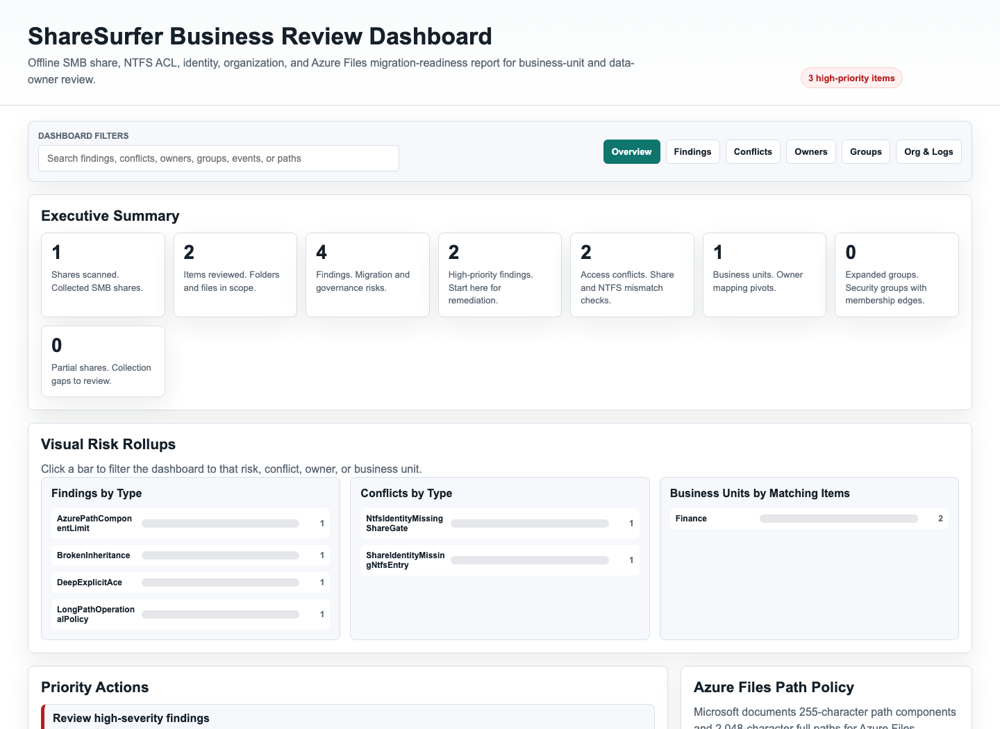
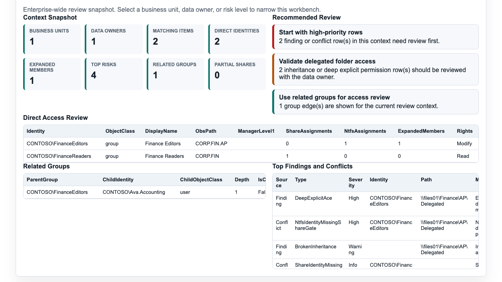
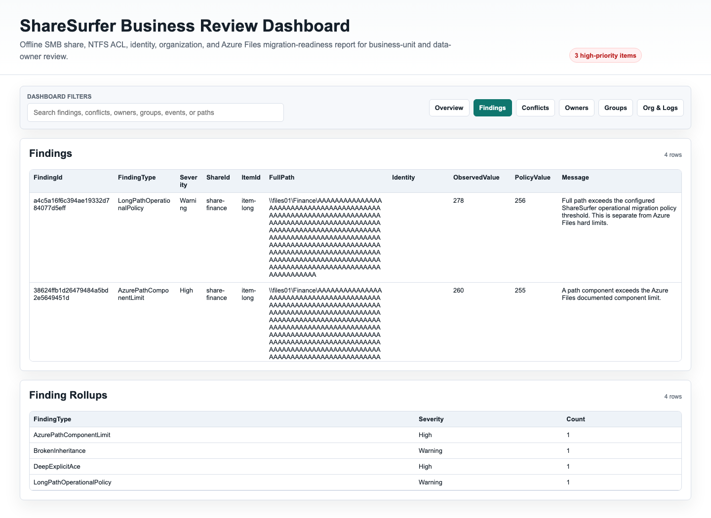
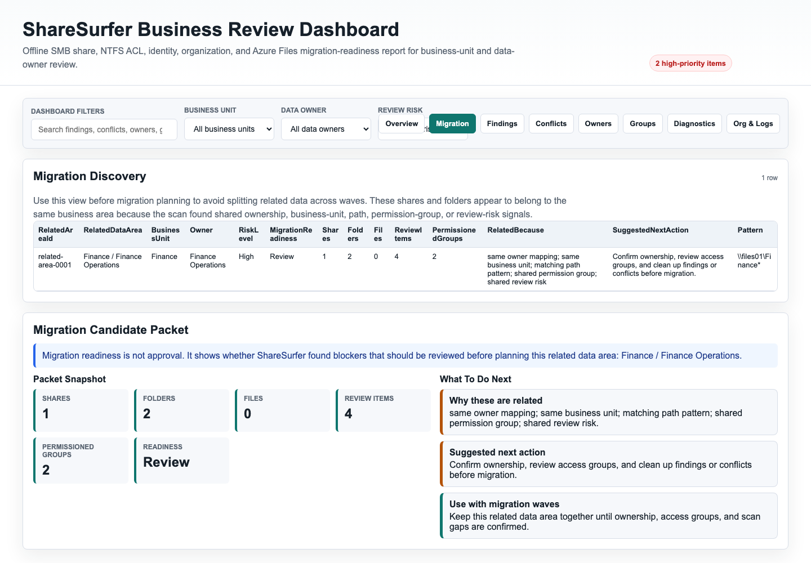
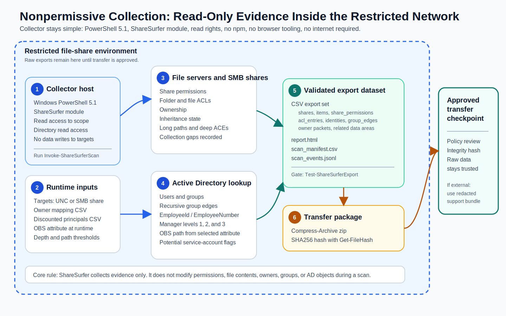

# ShareSurfer First-Run Guide

This guide is for a first-time ShareSurfer operator. You do not need to be a senior Windows, Active Directory, or file-share engineer to get a useful first scan. Follow the steps in order and keep the raw export inside your trusted environment.

## What ShareSurfer Does

ShareSurfer reads Windows file-share information and turns it into CSV files and an offline report.

It helps answer plain questions:

- Which shares and folders did we scan?
- Who has access at the share level?
- Who has access at the folder or file level?
- Where was inheritance broken?
- Which permissions were added deep in a folder tree?
- Which paths may create migration work?
- Which data owner, manager chain, or business unit should review the access?
- Which support data can be shared safely after redaction?

ShareSurfer does not make access changes. It collects, normalizes, reports, and redacts evidence.

## Prerequisites

Use a Windows collector machine with:

- Windows PowerShell 5.1.
- The ShareSurfer repository copied to a local folder.
- Permission to read the target share, files, folders, owners, and ACLs.
- Permission to read share-level permissions when scanning Windows SMB shares.
- Directory read access if you want user, group, manager, employee, and OBS enrichment.
- A local output folder with enough free space for CSVs, logs, reports, and support bundles.

For AD enrichment, record the OBS attribute before scanning. The default is `extensionAttribute10`, but your environment may use another extension attribute. Some labs do not have Exchange-style extension attributes in the AD schema; in that case, choose an attribute that exists on both users and groups, such as `info`, and pass it with `-ObsAttribute`. ShareSurfer records the selected attribute in `scan_manifest.csv` and in each enriched identity row so reviewers can see exactly which OBS source was used.

For lab validation, use the designated Windows/AD lab host directly.

## Step 1: Open PowerShell

Open Windows PowerShell 5.1 as the account that will run the scan.

For the best first run, right-click Windows PowerShell and choose **Run as administrator**. ShareSurfer can still collect what your current token can read without elevation, but a non-elevated token may miss or partially record:

- Share-level permission proof from `Get-SmbShareAccess`, remote CIM/WinRM calls, or native SMB/RPC security descriptors.
- ACLs on protected folders or files.
- Owner values on protected objects.
- Child folders/files where traversal or enumeration is denied.
- Security descriptor details that require backup, restore, security, or take-ownership style privileges.
- Clear evidence that a scan gap is caused by permissions instead of a missing path or unavailable service.

When this happens, ShareSurfer keeps running where it can and records partial-data, collection-error, and critical scan blocker evidence. Treat those rows as "review before approval", not as clean scan results.

Check the version:

```powershell
$PSVersionTable.PSVersion
```

The major version should be `5`.

If you are using the `v0.1.0-pre.5` release ZIP, extract it to `C:\ShareSurfer\`. The extracted release root should be:

```text
C:\ShareSurfer\ShareSurfer-0.1.0-pre.5\
```

If Windows Explorer suggests extracting to `C:\ShareSurfer\ShareSurfer-0.1.0-pre.5`, change the destination to `C:\ShareSurfer` so you do not end up with a doubled nested folder. From PowerShell:

```powershell
$releaseZip = 'C:\ShareSurfer\downloads\ShareSurfer-0.1.0-pre.5.zip'
$releaseRoot = 'C:\ShareSurfer\ShareSurfer-0.1.0-pre.5'

Expand-Archive -LiteralPath $releaseZip -DestinationPath 'C:\ShareSurfer' -Force
Test-Path "$releaseRoot\src\ShareSurfer\ShareSurfer.psd1"
Test-Path "$releaseRoot\interface\standalone-dashboard\dist\index.html"
```

The two `Test-Path` commands should return `True`. The first proves the PowerShell module is present. The second proves the standalone dashboard template assets are already built in the release package.

Go to the release or repository folder:

```powershell
Set-Location $releaseRoot
```

Import the module:

```powershell
Import-Module "$releaseRoot\src\ShareSurfer\ShareSurfer.psd1" -Force
```

Confirm the commands are available:

```powershell
Get-Command -Module ShareSurfer
```

## Step 2: Choose Scan Targets

Start with one small or medium share before scanning a large file server.

Good first targets:

- A known business share such as `\\files01\Finance`.
- A share with a known data owner.
- A share where you have read permission across most folders.
- A share that has a mix of normal and unusual permissions.

Avoid for the first run:

- A whole file server with hundreds of shares.
- A share where your account cannot read many folders.
- A production-critical path you do not understand yet.

Use a UNC path when you already know the share:

```powershell
$targetPath = '\\files01\Finance'
```

Use computer and share name when you want ShareSurfer to query SMB share metadata:

```powershell
$computerName = 'files01'
$shareName = 'Finance'
```

## Step 3: Prepare Output Folders

Use a new output folder for every scan. A dated folder keeps results easy to compare.

```powershell
$exportPath = 'C:\ShareSurfer\exports\scan-2026-06-04-finance'
New-Item -ItemType Directory -Path $exportPath -Force
New-Item -ItemType Directory -Path 'C:\ShareSurfer\inputs' -Force
```

Keep raw exports internal. They can contain real paths, server names, user names, group names, employee IDs, manager names, and OBS values.

### Optional Owner Mapping

In ShareSurfer, **Owner** means the business or data-review owner assigned by mapping rules. It is not the same thing as the Windows/NTFS owner recorded in `items.csv`.

Create an owner mapping CSV when you know who should review a path:

```powershell
@(
  [pscustomobject]@{
    Pattern = '\\files01\Finance*'
    Owner = 'Finance Operations'
    BusinessUnit = 'Finance'
    Source = 'first-run'
  }
) | Export-Csv -LiteralPath 'C:\ShareSurfer\inputs\owner-mapping.csv' -NoTypeInformation -Encoding UTF8
```

If you do not have owner mappings yet, skip `-OwnerMappingPath` for the first scan. ShareSurfer will still export evidence, but `owner_review_packets.csv` will be less useful because review rows cannot be routed as cleanly to business owners and business units.

If broad operational groups have access almost everywhere, create a discounted principals CSV before the scan:

```powershell
@(
  [pscustomobject]@{
    Identity = 'CONTOSO\HelpDeskOps'
    Reason = 'Broad HelpDesk access'
    Scope = 'Global'
  }
) | Export-Csv -LiteralPath 'C:\ShareSurfer\inputs\discounted-principals.csv' -NoTypeInformation -Encoding UTF8
```

Use this for admin, HelpDesk, scanner, backup, or platform access that should stay visible in the evidence but should not make unrelated areas look related in Migration Discovery.

## Step 4: Run the Collector

For a first scan by UNC path:

```powershell
$ownerMappingPath = 'C:\ShareSurfer\inputs\owner-mapping.csv'
$discountedPrincipalPath = 'C:\ShareSurfer\inputs\discounted-principals.csv'

$scanParams = @{
  TargetPath = $targetPath
  OutputPath = $exportPath
  OperationalPathLengthThreshold = 256
  ExplicitAceDepthThreshold = 2
  GroupExpansionMaxDepth = 5
  ManagerIdentityFormat = 'MailTo'
  AdLookupMode = 'Auto'
  ObsAttribute = 'extensionAttribute10'
}

if (Test-Path -LiteralPath $ownerMappingPath) {
  $scanParams.OwnerMappingPath = $ownerMappingPath
}

if (Test-Path -LiteralPath $discountedPrincipalPath) {
  $scanParams.DiscountedPrincipalPath = $discountedPrincipalPath
}

Invoke-ShareSurferScan @scanParams
```

For a first scan by SMB computer and share name:

```powershell
$ownerMappingPath = 'C:\ShareSurfer\inputs\owner-mapping.csv'
$discountedPrincipalPath = 'C:\ShareSurfer\inputs\discounted-principals.csv'

$scanParams = @{
  ComputerName = $computerName
  ShareName = $shareName
  OutputPath = $exportPath
  IncludeFiles = $true
  OperationalPathLengthThreshold = 256
  ExplicitAceDepthThreshold = 2
  GroupExpansionMaxDepth = 5
  ManagerIdentityFormat = 'MailTo'
  AdLookupMode = 'Auto'
  ObsAttribute = 'extensionAttribute10'
}

if (Test-Path -LiteralPath $ownerMappingPath) {
  $scanParams.OwnerMappingPath = $ownerMappingPath
}

if (Test-Path -LiteralPath $discountedPrincipalPath) {
  $scanParams.DiscountedPrincipalPath = $discountedPrincipalPath
}

Invoke-ShareSurferScan @scanParams
```

Use `-IncludeFiles` when you need file-level evidence, not only folder-level evidence. File-level scans can take longer on large shares.

Use `-AdLookupMode Auto` for normal collection. It tries the best available directory lookup path. Use `DirectoryOnly` only for imported test data.

Use `-ManagerIdentityFormat MailTo` unless you have a reason to export another format. It is the default and makes `ManagerLevel1`, `ManagerLevel2`, and `ManagerLevel3` easier for reviewers to use. Other supported values are `Mail`, `UserPrincipalName`, `SamAccountName`, and `DistinguishedName`. Raw manager references are preserved in `ManagerLevel1Raw`, `ManagerLevel2Raw`, and `ManagerLevel3Raw` when available.

The collector prints timestamped status lines while it runs. That is expected and helps first-time operators tell the scan is still active during recursive folder enumeration, ACL reads, identity enrichment, and CSV export. When the scan finishes, the `ShareSurfer Summary` lines show counts for shares, items, findings, conflicts, collection errors, and partial shares. They also show the output path and the next `Test-ShareSurferExport` command to run. If the summary mentions collection errors or partial shares, open `collection_errors.csv` and the Diagnostics view before asking an owner to approve the result. Add `-Quiet` when a scheduled or scripted run should suppress console progress.

Do not pass `-OwnerMappingPath` or `-DiscountedPrincipalPath` unless the CSV file exists. The splatted examples above check first, which avoids stopping the scan because an optional input file was not created yet.

If the target cannot accept WinRM/CIM, ShareSurfer continues best-effort when it can still inspect the path. The scan will mark share-level permission proof as partial or unavailable in the exports instead of treating that alone as a hard stop.

If the collector host is Windows and you are scanning explicit Windows SMB shares, use the native SMB/RPC provider when WinRM/CIM is blocked:

```powershell
Invoke-ShareSurferScan `
  -ComputerName 'files01' `
  -ShareName 'Finance' `
  -SmbCollectionProvider NativeSmbRpc `
  -OutputPath $exportPath `
  -ObsAttribute 'extensionAttribute10' `
  -ManagerIdentityFormat MailTo
```

`NativeSmbRpc` is a collection provider, not a different report format. It feeds the same CSVs and dashboard, but it uses Windows SMB/RPC and Win32 security APIs for share metadata, share permissions, owner values, and DACL evidence. It does not require WinRM/CIM, `Get-SmbShare`, `Get-SmbShareAccess`, or `Get-Acl` for the native provider path. It still needs enough share/file permissions to read the target evidence; unreadable paths and missing security descriptors are shown as partial data, collection errors, and scan events.

## Step 5: Validate the Export

Run validation after every scan:

```powershell
$validation = Test-ShareSurferExport -ExportPath $exportPath
$validation
```

If `IsValid` is `True`, the expected CSV set exists and has the required columns.

If `IsValid` is `False`, look at:

- `MissingFiles`
- `SchemaErrors`
- `FileResults`

Validation does not prove that the scan reached every file. It proves the export structure is usable.

## Step 6: Understand Outputs

The most important CSVs for a first review are:

| File | First thing to look for |
| --- | --- |
| `scan_manifest.csv` | Scan settings, OBS attribute, thresholds, lookup mode, and whether file objects were included. |
| `shares.csv` | Which shares were scanned and whether data was partial. Partial rows may mean a target path could not be resolved, share-level permissions were unavailable, folder enumeration failed, or ACL reads failed for part of the tree. |
| `items.csv` | Folders and files found under each share. |
| `share_permissions.csv` | The share-level access gate. |
| `acl_entries.csv` | Folder and file permissions. |
| `findings.csv` | Long-path warnings, broken inheritance, deep explicit ACEs, Broken/Missing SID rows, unavailable owner metadata, collection errors, and potential service account review flags. |
| `conflicts.csv` | Share-vs-NTFS access mismatches. |
| `identities.csv` | User and group details such as employee and OBS values. |
| `group_edges.csv` | Expanded group membership paths. |
| `org_chains.csv` | Manager, manager's manager, and third-level manager context when populated. |
| `owner_mappings.csv` | Business owner and business unit rules. |
| `owner_risk_pivots.csv` | Owner/business-unit review queue with mapped item counts, direct identities, direct groups, expanded members, findings, conflicts, partial shares, and risk level. |
| `related_data_areas.csv` | Migration discovery rows for like-owned shares, folders, and files that should be reviewed together before migration planning. |
| `owner_review_packets.csv` | Plain-language owner review packets showing why review is needed, where to start, and the suggested next action. |
| `identities.csv` | Users, groups, manager fields, OBS values, potential service-account flags, and extra directory clues such as mail, department, title, company, office, account status, and distinguished name. |
| `permissioned_groups.csv` | Groups that directly grant share or folder/file access, including assignment counts, rights, expanded members, and expansion health. |

Start with `owner_review_packets.csv`, `owner_risk_pivots.csv`, `related_data_areas.csv`, `permissioned_groups.csv`, `findings.csv`, and `conflicts.csv`, then use the report to pivot by business unit, owner, manager, OBS path, and group.

`owner_review_packets.csv` is generated automatically during `Invoke-ShareSurferScan`. You do not create that file by hand. To make it useful, provide `owner-mapping.csv` before the scan, run the scan, then confirm the export contains:

```powershell
Import-Csv "$exportPath\owner_review_packets.csv" | Select-Object -First 10
```

If the file exists but owner or business-unit values are blank or too generic, update `owner-mapping.csv` and rerun the scan.

If `Owner` is blank in `items.csv`, ShareSurfer did not receive a usable NTFS owner value for that item. That can mean the owner read was denied, the object has an unresolved owner SID, the path was partially collected, or the source did not return owner metadata. It does not automatically mean the file has no real Windows owner.

If `OwnerMetadataUnavailable` appears in `findings.csv`, use it as the review queue signal for those blank `items.csv` owner values. Confirm whether the collector was run with enough rights to read owner metadata, then rerun or validate the owner with normal Windows/file-share tools.

If `BrokenOrMissingSid` appears in `findings.csv`, a permission referenced a SID or account name ShareSurfer could not resolve. Review it with the directory or file-share team; common causes include deleted accounts, broken trust references, or directory lookup gaps.

If `PotentialServiceAccount=True` appears in `identities.csv` or a `PotentialServiceAccount` row appears in `findings.csv`, ask the owner or directory team to confirm the account purpose. It may be a real service account, or it may simply be a human account with missing OBS and employee identifier data.

## Step 7: Generate the Offline Report

Create the report:

```powershell
ConvertTo-ShareSurferReport -ExportPath $exportPath -OutputPath "$exportPath\report.html"
```

Open `report.html` from the export folder. It does not need a server or internet access.

Example dashboard overview:



Example review workbench:



Example findings drilldown:



Example migration discovery view:



These four images show the generated offline `report.html` experience. Current standalone dashboard examples are preserved in [visuals/dashboard-screenshots/2026-06-09-current](visuals/dashboard-screenshots/2026-06-09-current/README.md), including the overview, ad-hoc table filtering, findings filters, Permissioned Group Review, path context drilldown, sidebar collapse, Migration Discovery selector filtering, and local review decision controls.

Use the dashboard to review:

- Executive summary cards.
- Key Terms on the Overview tab for plain-English definitions of Owner, No owner, Broken/Missing SID, Collection error, Partial data, Discounted access principal, and Critical scan information block.
- What Needs Review First owner review queue for business-unit and data-owner review packets.
- Broken/Missing SID filters when unresolved permission identities need focused review.
- Critical scan information blocks for access denied, unauthorized, or path-resolution gaps.
- Review Workbench snapshot for the selected business unit, data owner, or risk level.
- Access Model view showing share gate permissions beside file/folder permissions.
- Migration Discovery rows showing related data areas that should be kept together during migration planning.
- Direct Access Review table showing directly assigned identities, share-gate assignments, NTFS assignments, OBS context, and expanded group-member counts.
- Priority actions.
- Visual risk rollups. Click a bar to filter the dashboard to that finding type, conflict type, owner, or business unit.
- Dashboard-level search, business-unit filters, data-owner filters, review-risk filters, and view tabs.
- Business-unit and owner pivots, including mapped item counts, finding counts, conflict counts, partial-share counts, and a simple review risk level.
- Finding rollups.
- Conflict rollups.
- Permissioned Group Review rows showing assigned security groups, share and NTFS assignment counts, OBS context, rights, and expanded membership size. Select a group row to focus the Group Browser on that expanded membership path.
- Diagnostics view for partial shares, collection errors, and scan events.
- Org-chain rollups.
- Inheritance breaks.
- Explicit permissions deeper than level 2.
- Group expansion browsing.
- Raw Evidence Tables when an operator needs to browse the underlying CSV-shaped rows inside the offline report. This is secondary evidence browsing, not the first place to send a business owner.

Path note: Microsoft documents Azure Files limits of 255-character path components and 2,048-character full paths. ShareSurfer's default warning for full paths over 256 characters is an operational migration policy warning, not a claim that Azure Files cannot store the path.

## Optional: Move the Dataset to a Dashboard Host

Use this when the collector host is locked down but reviewers can use a more permissive workstation for dashboard review.



The collector host only needs Windows PowerShell 5.1, ShareSurfer, and read access to the targets. It does not need npm, Vite, Playwright, internet access, or a local web server.

Package the validated export folder:

```powershell
$scanId = 'scan-2026-06-04-finance'
$packageRoot = 'C:\ShareSurfer\packages'
New-Item -ItemType Directory -Path $packageRoot -Force

$zipPath = Join-Path $packageRoot "$scanId.zip"
Compress-Archive -LiteralPath (Join-Path $exportPath '*') -DestinationPath $zipPath -Force
Get-FileHash -LiteralPath $zipPath -Algorithm SHA256 |
  Export-Csv -LiteralPath "$zipPath.sha256.csv" -NoTypeInformation -Encoding UTF8
```

Move the zip and hash by your approved transfer process. On the dashboard host, unpack the dataset and open the report:

```powershell
$reviewRoot = 'D:\ShareSurfer\reviews\scan-2026-06-04-finance'
New-Item -ItemType Directory -Path $reviewRoot -Force
Expand-Archive -LiteralPath 'D:\Intake\scan-2026-06-04-finance.zip' -DestinationPath $reviewRoot
Start-Process (Join-Path $reviewRoot 'report.html')
```

For the longer version, see the [nonpermissive collector to dashboard host workflow](nonpermissive-collection-dashboard-workflow.md).

## Optional: Generate the Standalone Dashboard

The legacy `report.html` remains the safest default report because it is generated directly by the PowerShell module. The [v0.1.0-pre.5 release package](https://github.com/jonathanweinberg/ShareSurfer/releases/tag/v0.1.0-pre.5) also includes prebuilt standalone dashboard template assets for richer novice-admin and business-owner review.

If you are using the release ZIP, you do not need Node, npm, Vite, a development server, or internet access to package the dashboard. Run the packager from Windows PowerShell 5.1 and point it at the extracted release root:

```powershell
$releaseRoot = 'C:\ShareSurfer\ShareSurfer-0.1.0-pre.5'

powershell.exe -NoLogo -NoProfile -ExecutionPolicy Bypass -File "$releaseRoot\scripts\New-ShareSurferStandaloneDashboard.ps1" `
  -ExportPath $exportPath `
  -OutputPath "$exportPath\standalone-dashboard" `
  -Force

Start-Process "$exportPath\standalone-dashboard\index.html"
```

Only maintainers building from source need to build the dashboard assets with Node and npm:

```powershell
npm --prefix interface/standalone-dashboard run build
```

Package the current export into a standalone static folder with PowerShell 7:

```powershell
pwsh -NoLogo -NoProfile -File scripts/New-ShareSurferStandaloneDashboard.ps1 `
  -ExportPath $exportPath `
  -OutputPath "$exportPath\standalone-dashboard" `
  -Force
```

Open `standalone-dashboard\index.html` on Windows or `standalone-dashboard/index.html` on macOS. The folder is self-contained: it uses relative bundled assets, `sharesurfer-data.js`, and `dashboard-manifest.json`; it does not need npm, Vite, a server, internet access, or browser `fetch` permissions.

## Step 8: Create a Redacted Support Bundle

Only create a support bundle after the raw export validates.

```powershell
New-ShareSurferSupportBundle `
  -ExportPath $exportPath `
  -OutputPath 'C:\ShareSurfer\support\scan-2026-06-04-finance-redacted' `
  -RedactionMode StableToken `
  -RedactionSalt 'case-2026-06-04-finance' `
  -IncludeReport
```

Validate the redacted bundle:

```powershell
Test-ShareSurferExport -ExportPath 'C:\ShareSurfer\support\scan-2026-06-04-finance-redacted'
```

Before sharing the bundle, search it for real domain names, server names, share names, user names, group names, and business unit names. The bundle should contain stable tokens such as `ID-000001`, not raw sensitive values.

Use a case-specific `-RedactionSalt` when you may need to compare multiple support bundles from the same case. If you leave it blank, ShareSurfer generates a fresh salt and token values may change between bundles. Do not reuse one broad salt across unrelated cases, because that can make cross-case correlation easier.

## Step 9: What To Do Next

For a first business review:

1. Give the report to the expected data owner or business unit lead.
2. Ask them to confirm the owner mapping and business unit mapping.
3. Review high-severity conflicts first.
4. Review broken inheritance and deep explicit ACEs.
5. Review long-path operational warnings before migration planning.
6. Expand assigned security groups and confirm whether membership matches the owner's expectation.
7. Repeat the scan after access cleanup or owner mapping changes.

For a migration review:

1. Separate hard platform limits from operational migration policy warnings.
2. Treat share-level permissions and NTFS permissions as two gates that both matter.
3. Use owner/business-unit pivots to route remediation work.
4. Keep evidence from the same export folder together.

## Common First-Run Problems

| Symptom | What to check |
| --- | --- |
| The scan shows partial data | Open `shares.csv` and read `PartialReason`. Confirm the target path exists and that your account can read share metadata, folders, files, and ACLs, then check `findings.csv` for `CollectionError` rows. |
| Identity details are missing | Confirm directory read access and the selected `-AdLookupMode`. |
| OBS values are blank | Confirm the correct `-ObsAttribute`, such as `extensionAttribute10`. If that attribute does not exist in your AD schema, use an existing user/group attribute such as `info`. |
| Group expansion is incomplete | Increase `-GroupExpansionMaxDepth` or check for directory lookup errors. |
| The report is sparse | Confirm `Test-ShareSurferExport` passed and the scan target contained data. |
| A support bundle still shows real names | Do not share it. Regenerate with redaction and inspect again. |

## Quick Command Set

```powershell
Import-Module .\src\ShareSurfer\ShareSurfer.psd1 -Force

$exportPath = 'C:\ShareSurfer\exports\scan-2026-06-04-finance'

Invoke-ShareSurferScan `
  -TargetPath '\\files01\Finance' `
  -OutputPath $exportPath `
  -OperationalPathLengthThreshold 256 `
  -ExplicitAceDepthThreshold 2 `
  -GroupExpansionMaxDepth 5 `
  -DiscountedPrincipalPath 'C:\ShareSurfer\inputs\discounted-principals.csv' `
  -AdLookupMode Auto `
  -ObsAttribute 'extensionAttribute10'

Test-ShareSurferExport -ExportPath $exportPath
ConvertTo-ShareSurferReport -ExportPath $exportPath -OutputPath "$exportPath\report.html"

New-ShareSurferSupportBundle `
  -ExportPath $exportPath `
  -OutputPath 'C:\ShareSurfer\support\scan-2026-06-04-finance-redacted' `
  -RedactionMode StableToken `
  -RedactionSalt 'case-2026-06-04-finance' `
  -IncludeReport
```
