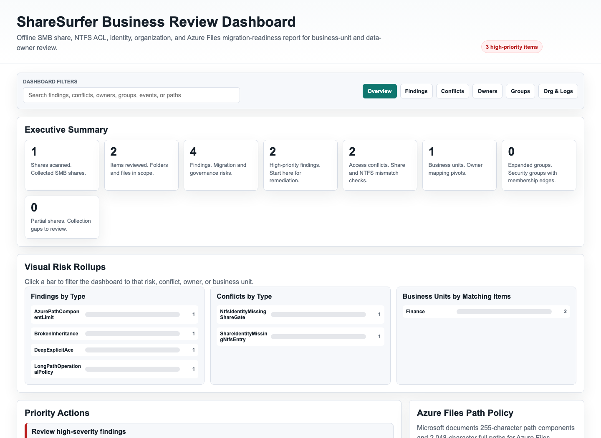
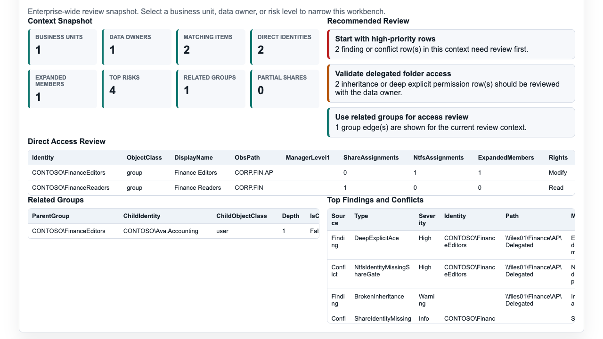
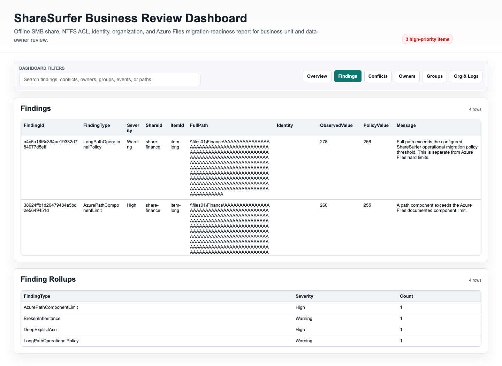
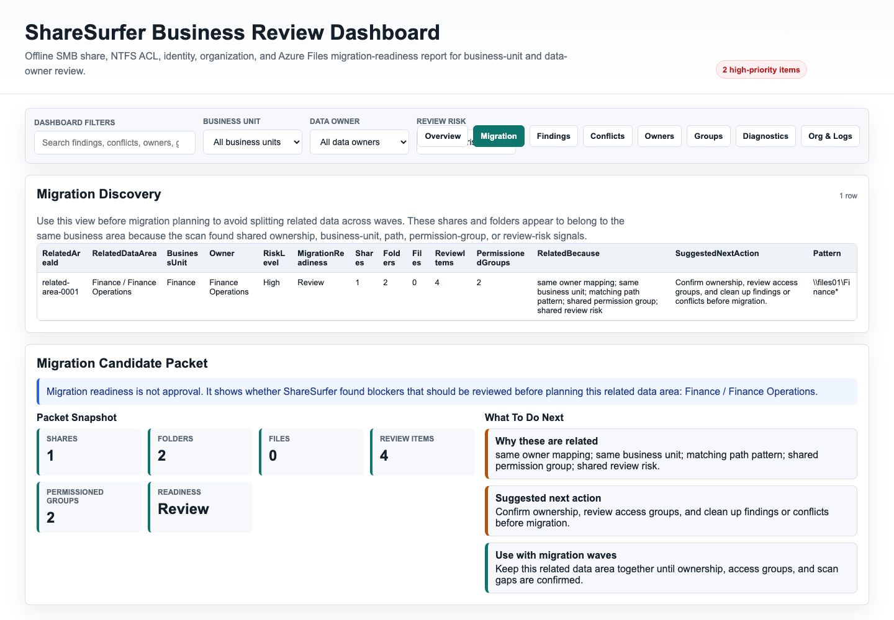

# ShareSurfer First-Run Guide

This guide is for a first-time ShareSurfer operator. You do not need to be a senior Windows, Active Directory, or file-share engineer to get a useful first scan. Follow the steps in order and keep the raw export inside your trusted environment.

If report or command terms are unfamiliar, keep the [glossary](glossary.md) open while you work.

## Start Here

For a first useful scan:

1. Extract the current `v0.1.0-pre.34` release ZIP to `C:\`. If that checkpoint tag is not visible on the [ShareSurfer Releases page](https://github.com/jonathanweinberg/ShareSurfer/releases) yet, use the latest published prerelease and substitute that version in the paths below.
2. Use `C:\ShareSurfer-0.1.0-pre.34\` as `$releaseRoot`, or replace the version folder with the published prerelease you actually extracted.
3. Run the recursive `Unblock-File` command in Step 1 before importing the module.
4. Pick one known share and the correct `-ObsAttribute`.
5. Recommended: run `Start-ShareSurfer.ps1` or `Start-ShareSurferStartup` to generate a reusable first-run JSON config, plan, and rerun script.
6. If HR, employee, OBS, project, or owner CSVs exist, let the startup prompts help build `ownership-enrichment.csv`, or normalize them before scanning with the ownership import commands.
7. Run the collector, validate the export, and build `report.html`.
8. Package the standalone dashboard from the validated export only when you need the richer local dashboard.
9. Check the stop gates before sending anything to a business owner.

Stop gates are conditions that make the scan unsafe to treat as complete owner-review evidence. They include unresolved partial data, collection errors, wrong or missing OBS attributes, template dashboard confusion, protocol readiness blockers, and missing owner/business-unit mapping when owner review is expected.

## What ShareSurfer Does

ShareSurfer reads Windows file-share information and turns it into CSV files and an offline report.

It helps answer plain questions:

- Which shares and folders did we scan?
- Who has access at the share level?
- Who has access at the folder or file level?
- Where was inheritance broken?
- Which permissions were added deep in a folder tree?
- Which paths may create migration work?
- Which data owner, manager chain, or business unit should review the access?
- Which support data can be shared safely after redaction?

ShareSurfer does not make access changes. It collects, normalizes, reports, and redacts evidence.

## Before You Run Checklist

Write these answers down before the first scan:

- Target path or share: for example `\\files01\Finance`, or `ComputerName=files01` and `ShareName=Finance`.
- Export folder: use a new folder such as `C:\ShareSurfer\exports\scan-001`.
- OBS attribute: default is `extensionAttribute10`, but your directory may use another attribute such as `info`.
- Owner mapping: decide whether you already have `owner-mapping.csv`, or whether the first scan will run without owner routing.
- Ownership enrichment: decide whether HR, employee, OBS, OID, project, or owner CSVs should be joined with AD data before scanning.
- Discounted principals: decide whether broad HelpDesk, admin, scanner, backup, or platform groups should be listed in `discounted-principals.csv`.
- Collector account: confirm whether the PowerShell prompt is elevated and whether the account can read shares, folders, files, ACLs, owner values, and directory data.
- Dashboard path: decide whether the same machine will open the report, or whether you need the two-host workflow.

If you are unsure about optional input files, leave them absent and use the splatted examples in this guide. They only pass optional paths when the files exist.

If you already know which task you need to run and only want copy/paste commands, use the [command recipes](command-recipes.md). That page collects release extraction, module import, UNC scans, SMB scans, NativeSmbRpc fallback, dashboard packaging, two-host handoff, open-file assessment, and support bundle commands.

## Prerequisites

Use a Windows collector machine with:

- Windows PowerShell 5.1.
- The ShareSurfer repository copied to a local folder.
- Permission to read the target share, files, folders, owners, and ACLs.
- Permission to read share-level permissions when scanning Windows SMB shares.
- Directory read access if you want user, group, manager, employee, and OBS enrichment.
- A local output folder with enough free space for CSVs, logs, reports, and support bundles.

For AD enrichment, record the OBS attribute before scanning. The default is `extensionAttribute10`, but your environment may use another extension attribute. Some labs do not have Exchange-style extension attributes in the AD schema; in that case, choose an attribute that exists on both users and groups, such as `info`, and pass it with `-ObsAttribute`. ShareSurfer records the selected attribute in `scan_manifest.csv` and in each enriched identity row so reviewers can see exactly which OBS source was used.

For lab validation, use the designated Windows/AD lab host directly.

## Step 1: Open PowerShell

Open Windows PowerShell 5.1 as the account that will run the scan.

For the best first run, right-click Windows PowerShell and choose **Run as administrator**. ShareSurfer can still collect what your current token can read without elevation, but a non-elevated token may miss or partially record:

- Share-level permission proof from `Get-SmbShareAccess`, remote CIM/WinRM calls, or native SMB/RPC security descriptors.
- ACLs on protected folders or files.
- Owner values on protected objects.
- Child folders/files where traversal or enumeration is denied.
- Security descriptor details that require backup, restore, security, or take-ownership style privileges.
- Clear evidence that a scan gap is caused by permissions instead of a missing path or unavailable service.

When this happens, ShareSurfer keeps running where it can and records partial-data, collection-error, and critical scan blocker evidence. Treat those rows as "review before approval", not as clean scan results.

Check the version:

```powershell
$PSVersionTable.PSVersion
```

The major version should be `5`.

If you are using the `v0.1.0-pre.34` release ZIP, extract it to `C:\`. If that checkpoint tag is not visible yet, use the latest published prerelease and substitute that version in the paths below. The extracted release root should be:

```text
C:\ShareSurfer-0.1.0-pre.34\
```

If Windows Explorer suggests extracting to `C:\ShareSurfer-0.1.0-pre.34`, change the destination to `C:\` so you do not end up with a doubled nested folder. From PowerShell:

```powershell
$releaseZip = 'C:\Downloads\ShareSurfer-0.1.0-pre.34.zip'
$releaseRoot = 'C:\ShareSurfer-0.1.0-pre.34'

Expand-Archive -LiteralPath $releaseZip -DestinationPath 'C:\' -Force
Get-ChildItem -LiteralPath $releaseRoot -Recurse -File |
  Where-Object { $_.Extension -in '.ps1', '.psm1', '.psd1' } |
  Unblock-File
Test-Path "$releaseRoot\src\ShareSurfer\ShareSurfer.psd1"
Test-Path "$releaseRoot\interface\standalone-dashboard\dist\index.html"
```

The `Unblock-File` line clears the Windows downloaded-file block from ShareSurfer PowerShell files. It is safe to run again after re-extracting the release ZIP.

Run that manual unblock before the launcher when you want no security prompt wall. If you run `.\Start-ShareSurfer.ps1` before unblocking, Windows may still ask once for the launcher itself because ShareSurfer cannot unblock the launcher before Windows starts it. After you choose **Run once**, the launcher clears the remaining ShareSurfer PowerShell files before module import.

The two `Test-Path` commands should return `True`. The first proves the PowerShell module is present. The second proves the standalone dashboard template assets are already built in the release package.

Go to the release or repository folder:

```powershell
Set-Location $releaseRoot
```

Import the module:

```powershell
Import-Module "$releaseRoot\src\ShareSurfer\ShareSurfer.psd1" -Force
```

Confirm the commands are available:

```powershell
Get-Command -Module ShareSurfer
```

Recommended: generate a guided startup plan before scanning. This does not collect data or change permissions. It recursively unblocks local ShareSurfer PowerShell files, asks the first-run questions when run interactively, asks whether to run intensive share-permission diagnostics before the scan, checks for optional ownership files in the input folder, writes a reusable startup JSON config, then writes a JSON plan and a rerun script so you can review the requested diagnostic, scan, validation, and standalone dashboard packaging steps first. Optional CSV paths are only used by the rerun script when those files exist.

If `ownership-enrichment.csv` is missing, interactive startup can offer to open the multi-CSV ownership import picker. Use that when you have HR, employee, OBS, project, application, or owner CSVs that should enrich identities before the scan. The import writes `ownership-enrichment.csv`, `ownership_context.csv`, `ownership_relationships.csv`, `ownership_import_manifest.csv`, `ownership-import.definition.json`, and `ownership-import-rerun.ps1`, then returns to the normal startup flow.

If `owner-mapping.csv` is missing, startup can offer to add post-scan owner mapping draft creation to the generated rerun script. That draft is created after `Test-ShareSurferExport` succeeds because useful path patterns come from scan output. Fill `Owner` and `BusinessUnit` in `owner-mapping-draft.csv`, save it as `owner-mapping.csv`, then rerun the startup config or scan with that completed mapping.

After the interactive questions, ShareSurfer shows the generated file paths, offers to display the startup JSON, scan plan, and rerun script, and then asks whether to run the generated diagnostic/scan/validate/dashboard script now. The run prompt defaults to `No` so you can stop and review first.

The easiest release-root launcher is:

```powershell
powershell.exe -NoLogo -NoProfile -ExecutionPolicy Bypass -File "$releaseRoot\Start-ShareSurfer.ps1" -Force
```

If you already know the answers and want a copy/paste command:

```powershell
$inputRoot = 'C:\ShareSurfer\inputs'
$exportPath = 'C:\ShareSurfer\exports\scan-001'

New-Item -ItemType Directory -Force -Path $inputRoot | Out-Null

Start-ShareSurferStartup `
  -EnvironmentMode Permissive `
  -ReleaseRoot $releaseRoot `
  -InputRoot $inputRoot `
  -ExportPath $exportPath `
  -TargetPath '\\files01\Finance' `
  -ObsAttribute 'extensionAttribute10' `
  -SaveConfigPath (Join-Path $inputRoot 'sharesurfer-startup.config.json') `
  -PlanPath (Join-Path $inputRoot 'operator-assistant.plan.json') `
  -ReusableCommandPath (Join-Path $inputRoot 'operator-assistant-rerun.ps1') `
  -Force
```

Under the hood, the startup flow delegates to `Start-ShareSurferOperatorAssistant` to create the scan plan and rerun script. Review `sharesurfer-startup.config.json` and `operator-assistant-rerun.ps1` before running the rerun script. The startup config can regenerate the same pattern later:

```powershell
Start-ShareSurferStartup `
  -ConfigPath (Join-Path $inputRoot 'sharesurfer-startup.config.json') `
  -Force
```

The rerun script runs `Invoke-ShareSurferSharePermissionDiagnostic` before the scan by default and writes the proof/failure package under `$exportPath\share-permission-diagnostics`. It also runs `Invoke-ShareSurferPortProtocolAssessment` into `$exportPath` before dashboard packaging, so the standalone dashboard has `port_protocol_*.csv` readiness evidence without a separate manual step. Open `share_permission_diagnostics.md` when share-level permissions are missing, unexpected, or marked partial. The diagnostic path now records the server-returned share path, checks whether that path is actually local to the collector, and falls back to the target UNC path when a SAN or appliance returns a remote `C:\...` path that the collector cannot see. The collector also tries native SMB/RPC share-permission evidence for UNC target-path scans when `Get-SmbShareAccess` cannot return rows. The startup flow looks for `owner-mapping.csv`, `ownership-enrichment.csv`, `ownership_context.csv`, `ownership_relationships.csv`, `ownership_import_manifest.csv`, and `discounted-principals.csv` under `$inputRoot`, saves found or skipped choices into JSON, and the rerun script only passes optional paths when those files exist.

## Step 2: Choose Scan Targets

Start with one small or medium share before scanning a large file server.

Good first targets:

- A known business share such as `\\files01\Finance`.
- A share with a known data owner.
- A share where you have read permission across most folders.
- A share that has a mix of normal and unusual permissions.

Avoid for the first run:

- A whole file server with hundreds of shares.
- A share where your account cannot read many folders.
- A production-critical path you do not understand yet.

Use a UNC path when you already know the share:

```powershell
$targetPath = '\\files01\Finance'
```

Use computer and share name when you want ShareSurfer to query SMB share metadata:

```powershell
$computerName = 'files01'
$shareName = 'Finance'
```

### Which Scan Command Should I Use?

| Situation | Command shape | Notes |
| --- | --- | --- |
| You know the UNC path and only need a quick first pass | `-TargetPath '\\files01\Finance'` | Good first scan path. It may not prove every share-level permission layer when remote share metadata is unavailable. |
| You know the Windows file server and share name | `-ComputerName files01 -ShareName Finance` | Best when Windows SMB metadata and share permissions are important to the review. |
| WinRM/CIM is blocked on a Windows file server | Add `-SmbCollectionProvider NativeSmbRpc` | Uses native Windows SMB/RPC and Win32 security APIs where available. Still records partial data when permissions are missing. |
| You need file rows, not only folder rows | Add `-IncludeFiles` | Useful for migration proof and file-level owner/ACL review. Larger shares take longer. |
| You are testing imported fixture data | `-InputObject <inventory>` | Mainly for tests, demos, and controlled validation. Production operators should normally scan real targets. |

## Step 3: Prepare Output Folders

Use a new output folder for every scan. A dated folder keeps results easy to compare.

```powershell
$exportPath = 'C:\ShareSurfer\exports\scan-2026-06-04-finance'
New-Item -ItemType Directory -Path $exportPath -Force
New-Item -ItemType Directory -Path 'C:\ShareSurfer\inputs' -Force
```

Keep raw exports internal. They can contain real paths, server names, user names, group names, employee IDs, manager names, and OBS values.

### Optional Owner Mapping

In ShareSurfer, **Owner** means the business or data-review owner assigned by mapping rules. It is not the same thing as the Windows/NTFS owner recorded in `items.csv`.

Create an owner mapping CSV when you know who should review a path:

```powershell
@(
  [pscustomobject]@{
    Pattern = '\\files01\Finance\*'
    Owner = 'Finance Operations'
    BusinessUnit = 'Finance'
    Source = 'first-run'
  }
) | Export-Csv -LiteralPath 'C:\ShareSurfer\inputs\owner-mapping.csv' -NoTypeInformation -Encoding UTF8
```

If you do not have owner mappings yet, skip `-OwnerMappingPath` for the first scan. ShareSurfer will still export evidence, but `owner_review_packets.csv` will be less useful because review rows cannot be routed as cleanly to business owners and business units.

If your ownership data exists in an HR, employee, OBS, OID, cost-center, or owner CSV with unexpected headers, use the [admin ownership import guide](admin-ownership-import.md) before building `owner-mapping.csv`. If you are not sure what should count as an owner, how to handle service-account-like rows, or how to think about one person with multiple accounts, read the [ownership data thinking guide](ownership-data-thinking.md). The workflow is offline and deterministic:

```powershell
$sourcePath = 'C:\ShareSurfer\inputs\hr-obs.csv'
$profilePath = 'C:\ShareSurfer\inputs\hr-obs.mapping.json'
$normalizedPath = 'C:\ShareSurfer\inputs\normalized-ownership.csv'
$rerunPath = 'C:\ShareSurfer\inputs\ownership-import-rerun.ps1'

Test-ShareSurferOwnershipSource -Path $sourcePath

New-ShareSurferOwnershipMappingProfile `
  -Path $sourcePath `
  -OutputPath $profilePath `
  -ObsHeader 'CostCenterPath' `
  -ReusableCommandPath $rerunPath `
  -Force

Import-ShareSurferOwnershipSource `
  -Path $sourcePath `
  -MappingProfilePath $profilePath `
  -OutputPath $normalizedPath `
  -ReusableCommandPath $rerunPath `
  -Force
```

This creates `hr-obs.mapping.json`, `normalized-ownership.csv`, and `ownership-import-rerun.ps1`. Keep the rerun script with the input files so the next HR/OBS refresh can reuse the saved profile instead of repeating the header mapping interview.

If HR/OBS data should enrich the scan itself, build `ownership-enrichment.csv` before Step 4. This is the file that `Invoke-ShareSurferScan -OwnershipEnrichmentPath` reads. It can combine more than one CSV, use employee ID or employee number to find matching AD accounts, fill available mail/title/office/manager/OBS details from AD, and skip matches under forbidden OUs.

```powershell
$inputRoot = 'C:\ShareSurfer\inputs'
$ownershipEnrichmentPath = Join-Path $inputRoot 'ownership-enrichment.csv'
$ownershipDefinitionPath = Join-Path $inputRoot 'ownership-import.definition.json'
$ownershipRerunPath = Join-Path $inputRoot 'ownership-enrichment-rerun.ps1'

Join-ShareSurferOwnershipSources `
  -Interactive `
  -BrowseForCsv `
  -SourceFolder $inputRoot `
  -OutputPath $ownershipEnrichmentPath `
  -DefinitionPath $ownershipDefinitionPath `
  -ObsAttribute 'extensionAttribute10' `
  -AdLookupMode Auto `
  -ForbiddenOu @('OU=Service Accounts,DC=contoso,DC=com', 'OU=Admins,DC=contoso,DC=com') `
  -ReusableCommandPath $ownershipRerunPath `
  -Force
```

Use the text picker to choose one or more candidate CSVs. For example, one file might contain employee IDs and OBS, while another has project or business-unit context. The saved `ownership-import.definition.json` records the selected CSV paths, OBS attribute, AD lookup mode, and forbidden OU choices; `ownership-enrichment-rerun.ps1` rebuilds the same file later without repeating the picker.

If the scan has no owner mapping yet, create a draft for an admin to fill in after the first scan:

```powershell
New-ShareSurferOwnerMappingDraft `
  -ExportPath $exportPath `
  -OutputPath 'C:\ShareSurfer\inputs\owner-mapping-draft.csv' `
  -ReusableCommandPath 'C:\ShareSurfer\inputs\owner-mapping-rerun.ps1' `
  -Force
```

Open the draft, fill in `Owner` and, when known, `BusinessUnit`, save it as `owner-mapping.csv`, and rerun the scan with `-OwnerMappingPath`. Keep the `BusinessUnit` column header even when some values are blank. Blank `BusinessUnit` values are allowed but show up as unmapped business-unit gaps and scan-event warnings; a missing `BusinessUnit` column still means the owner mapping file is the wrong shape. The reusable `owner-mapping-rerun.ps1` file shows how to regenerate the draft from the same export and where the completed `owner-mapping.csv` belongs.

Before rerunning the scan with the completed mapping, validate it:

```powershell
Test-ShareSurferOwnerMapping `
  -Path 'C:\ShareSurfer\inputs\owner-mapping.csv' `
  -ExportPath $exportPath
```

Do not continue until `IsValid` is `True`. The validator catches missing required columns, blank owners, blank business units, dead patterns, and broad patterns that may accidentally match sibling shares.

If broad operational groups have access almost everywhere, create a discounted principals CSV before the scan:

```powershell
@(
  [pscustomobject]@{
    Identity = 'CONTOSO\HelpDeskOps'
    Reason = 'Broad HelpDesk access'
    Scope = 'Global'
  }
) | Export-Csv -LiteralPath 'C:\ShareSurfer\inputs\discounted-principals.csv' -NoTypeInformation -Encoding UTF8
```

Use this for admin, HelpDesk, scanner, backup, or platform access that should stay visible in the evidence but should not make unrelated areas look related in Migration Discovery.

## Step 4: Run the Collector

For a first scan by UNC path:

```powershell
$ownerMappingPath = 'C:\ShareSurfer\inputs\owner-mapping.csv'
$ownershipEnrichmentPath = 'C:\ShareSurfer\inputs\ownership-enrichment.csv'
$discountedPrincipalPath = 'C:\ShareSurfer\inputs\discounted-principals.csv'

$scanParams = @{
  TargetPath = $targetPath
  OutputPath = $exportPath
  OperationalPathLengthThreshold = 256
  ExplicitAceDepthThreshold = 2
  GroupExpansionMaxDepth = 5
  ManagerIdentityFormat = 'MailTo'
  AdLookupMode = 'Auto'
  ObsAttribute = 'extensionAttribute10'
}

if (Test-Path -LiteralPath $ownerMappingPath) {
  $scanParams.OwnerMappingPath = $ownerMappingPath
}

if (Test-Path -LiteralPath $ownershipEnrichmentPath) {
  $scanParams.OwnershipEnrichmentPath = $ownershipEnrichmentPath
}

if (Test-Path -LiteralPath $discountedPrincipalPath) {
  $scanParams.DiscountedPrincipalPath = $discountedPrincipalPath
}

Invoke-ShareSurferScan @scanParams
```

For a first scan by SMB computer and share name:

```powershell
$ownerMappingPath = 'C:\ShareSurfer\inputs\owner-mapping.csv'
$ownershipEnrichmentPath = 'C:\ShareSurfer\inputs\ownership-enrichment.csv'
$discountedPrincipalPath = 'C:\ShareSurfer\inputs\discounted-principals.csv'

$scanParams = @{
  ComputerName = $computerName
  ShareName = $shareName
  OutputPath = $exportPath
  IncludeFiles = $true
  OperationalPathLengthThreshold = 256
  ExplicitAceDepthThreshold = 2
  GroupExpansionMaxDepth = 5
  ManagerIdentityFormat = 'MailTo'
  AdLookupMode = 'Auto'
  ObsAttribute = 'extensionAttribute10'
}

if (Test-Path -LiteralPath $ownerMappingPath) {
  $scanParams.OwnerMappingPath = $ownerMappingPath
}

if (Test-Path -LiteralPath $ownershipEnrichmentPath) {
  $scanParams.OwnershipEnrichmentPath = $ownershipEnrichmentPath
}

if (Test-Path -LiteralPath $discountedPrincipalPath) {
  $scanParams.DiscountedPrincipalPath = $discountedPrincipalPath
}

Invoke-ShareSurferScan @scanParams
```

Use `-IncludeFiles` when you need file-level evidence, not only folder-level evidence. File-level scans can take longer on large shares.

Use `-AdLookupMode Auto` for normal collection. It tries the best available directory lookup path. Use `DirectoryOnly` only for imported test data.

Use `-ManagerIdentityFormat MailTo` unless you have a reason to export another format. It is the default and makes `ManagerLevel1`, `ManagerLevel2`, and `ManagerLevel3` easier for reviewers to use. Other supported values are `Mail`, `UserPrincipalName`, `SamAccountName`, and `DistinguishedName`. Raw manager references are preserved in `ManagerLevel1Raw`, `ManagerLevel2Raw`, and `ManagerLevel3Raw` when available.

The collector prints timestamped status lines while it runs. That is expected and helps first-time operators tell the scan is still active during recursive folder enumeration, ACL reads, identity enrichment, and CSV export. When the scan finishes, the `ShareSurfer Summary` lines show counts for shares, items, findings, conflicts, collection errors, and partial shares. They also show the output path and the next `Test-ShareSurferExport` command to run. If the summary mentions collection errors or partial shares, open `collection_errors.csv` and the Diagnostics view before asking an owner to approve the result. Add `-Quiet` when a scheduled or scripted run should suppress console progress.

Do not pass `-OwnerMappingPath`, `-OwnershipEnrichmentPath`, or `-DiscountedPrincipalPath` unless the CSV file exists. The splatted examples above check first, which avoids stopping the scan because an optional input file was not created yet.

If the target cannot accept WinRM/CIM, ShareSurfer continues best-effort when it can still inspect the path. The scan will mark share-level permission proof as partial or unavailable in the exports instead of treating that alone as a hard stop.

If the collector host is Windows and you are scanning explicit Windows SMB shares, use the native SMB/RPC provider when WinRM/CIM is blocked:

```powershell
Invoke-ShareSurferScan `
  -ComputerName 'files01' `
  -ShareName 'Finance' `
  -SmbCollectionProvider NativeSmbRpc `
  -OutputPath $exportPath `
  -ObsAttribute 'extensionAttribute10' `
  -ManagerIdentityFormat MailTo
```

`NativeSmbRpc` is a collection provider, not a different report format. It feeds the same CSVs and dashboard, but it uses Windows SMB/RPC and Win32 security APIs for share metadata, share permissions, owner values, and DACL evidence. It does not require WinRM/CIM, `Get-SmbShare`, `Get-SmbShareAccess`, or `Get-Acl` for the native provider path. It still needs enough share/file permissions to read the target evidence; unreadable paths, missing security descriptors, and unparseable security descriptors are shown as partial data, collection errors, and scan events. A passed SMB/RPC port check proves reachability, not that every share, owner, or folder/file security descriptor can be read.

Some older SANs and SMB appliances return a server-local path in share metadata, such as `C:\Public\DepartmentShare`, even though the collector was given `\\server\DepartmentShare`. ShareSurfer diagnostics treat that as a path-selection signal: if the returned path is not present on the collector, ShareSurfer attempts the UNC path automatically and records both the returned path and the fallback decision in the diagnostic CSV/Markdown output.

Optional readiness check:

```powershell
Invoke-ShareSurferPortProtocolAssessment `
  -ComputerName 'files01' `
  -ShareName 'Finance' `
  -DirectoryServer 'dc01.contoso.com' `
  -OutputPath $exportPath
```

This adds `port_protocol_manifest.csv`, `port_protocol_targets.csv`, and `port_protocol_checks.csv` beside the normal scan exports. The standalone dashboard shows them in **Ports & Protocols** below Raw Evidence. Use this when you need a plain-language explanation of which collector routes are reachable, what a failure means, and what to ask the firewall, server, or directory team to check. A failed WinRM/CIM row is usually a completeness/fallback warning; a failed required SMB TCP 445 row usually means the target is not scan-ready from that collector. A passed SMB/RPC row is still only a network signal; review `collection_errors.csv` for `NativeShareSecurityDescriptorUnavailable`, `NativeShareSecurityDescriptorParseFailed`, `NativeSecurityDescriptorReadFailed`, or `NativeSecurityDescriptorParseFailed` before treating native security evidence as complete.

Deeper file-share capability check:

```powershell
Invoke-ShareSurferFileShareConnectivityAssessment `
  -TargetPath '\\files01\Finance' `
  -OutputPath "$exportPath\connectivity-diagnostics" `
  -IncludeOpenFiles `
  -IncludeSessions
```

Use this when WinRM/CIM is unavailable, the server still appears manageable through Computer Management, or SMB/RPC ports are reachable but share permission or security descriptor evidence is missing. It tests more than ports: `New-CimSession`, `Get-SmbShare`, `Get-SmbShareAccess`, native `NetShareGetInfo`, share security descriptor parsing, filesystem owner/DACL reads through Win32 security APIs, open-file enumeration, and optional session enumeration. It writes raw diagnostics plus a `redacted` folder with `fileshare_connectivity_llm_summary.md` for safe support handoff. Share only the redacted folder unless your process allows raw host, share, path, account, and exception evidence to leave trusted handling.

Focused share-permission diagnostic:

```powershell
Invoke-ShareSurferSharePermissionDiagnostic `
  -TargetPath '\\files01\Finance' `
  -OutputPath "$exportPath\share-permission-diagnostics" `
  -Force
```

Use this when the scan could enumerate folders but could not prove share-level permissions. The console prints the exact files to open first: `share_permission_diagnostics.md`, `share_permission_diagnostics.csv`, and the redacted support-safe copy under `redacted\`.

## Step 5: Validate the Export

Run validation after every scan:

```powershell
$validation = Test-ShareSurferExport -ExportPath $exportPath
$validation
```

If `IsValid` is `True`, the expected CSV set exists and has the required columns.

If `IsValid` is `False`, look at:

- `MissingFiles`
- `SchemaErrors`
- `FileResults`

Validation does not prove that the scan reached every file. It proves the export structure is usable.

What good looks like after validation:

- `IsValid` is `True`.
- `scan_manifest.csv` shows the expected target mode, OBS attribute, manager identity format, thresholds, and `IncludeFiles` value.
- `evidence_confidence.csv` shows an evidence-completeness label and no unresolved stop gates for the review scope.
- `shares.csv` has the shares you expected to scan.
- Any `PartialData=True` share row has been reviewed in `collection_errors.csv`, `findings.csv`, and the report Diagnostics view.
- `owner_review_packets.csv` and `owner_risk_pivots.csv` contain useful owner/business-unit rows if you supplied owner mappings.
- `report.html` opens and the Overview, What Needs Review First, Findings, Conflicts, Groups, Diagnostics, and Raw Evidence views show the expected dataset.

If validation passes but the dataset looks wrong, use the [first-run troubleshooting guide](first-run-troubleshooting.md) before asking a business owner to approve the result.

## Step 6: Understand Outputs

The most important CSVs for a first review are:

| File | First thing to look for |
| --- | --- |
| `scan_manifest.csv` | Scan settings, OBS attribute, thresholds, lookup mode, and whether file objects were included. |
| `shares.csv` | Which shares were scanned and whether data was partial. Partial rows may mean a target path could not be resolved, share-level permissions were unavailable, folder enumeration failed, or ACL reads failed for part of the tree. |
| `items.csv` | Folders and files found under each share. |
| `share_permissions.csv` | The share-level access gate. |
| `acl_entries.csv` | Folder and file permissions. |
| `findings.csv` | Long-path warnings, broken inheritance, deep explicit ACEs, Broken/Missing SID rows, unavailable owner metadata, collection errors, and potential service account review flags. |
| `conflicts.csv` | Share-vs-NTFS access mismatches. |
| `evidence_confidence.csv` | Scan/share evidence completeness, stop/review gates, requested/effective provider, provider fallback, counted partial shares, counted collection errors, and recommended action. This is not permission approval. |
| `identities.csv` | Users, groups, manager fields, OBS values, potential service-account flags, and extra directory clues such as mail, department, title, company, office, account status, and distinguished name. |
| `group_edges.csv` | Expanded group membership paths. |
| `org_chains.csv` | Manager, manager's manager, and third-level manager context when populated. |
| `owner_mappings.csv` | Business owner and business unit rules. |
| `owner_risk_pivots.csv` | Owner/business-unit review queue with mapped item counts, direct identities, direct groups, expanded members, findings, conflicts, partial shares, and risk level. |
| `related_data_areas.csv` | Migration discovery rows for like-owned shares, folders, and files that should be reviewed together before migration planning. |
| `owner_review_packets.csv` | Plain-language owner review packets showing why review is needed, where to start, and the suggested next action. |
| `owner_review_decisions.csv` | Optional owner packet review decisions after an admin generates a draft and imports reviewer edits. Current scans write this file header-only until decisions are imported. |
| `migration_cluster_decisions.csv` | Optional Migration Discovery decisions after reviewers classify related data areas. Current scans write this file header-only until decisions are imported. |
| `permissioned_groups.csv` | Groups that directly grant share or folder/file access, including assignment counts, rights, expanded members, and expansion health. |
| `open_file_summary.csv` | Optional hot-folder activity summary when `Invoke-ShareSurferOpenFileAssessment` was run. |
| `port_protocol_targets.csv` | Optional target readiness summary when `Invoke-ShareSurferPortProtocolAssessment` was run. |
| `port_protocol_checks.csv` | Optional detailed protocol evidence with operator guidance and remediation hints. |

Start with `evidence_confidence.csv`, `owner_review_packets.csv`, `owner_risk_pivots.csv`, `related_data_areas.csv`, `permissioned_groups.csv`, `findings.csv`, and `conflicts.csv`, then use the report to pivot by business unit, owner, manager, OBS path, and group. Confidence is evidence completeness, not permission approval. Partial data or collection errors can block owner signoff until the operator resolves, reruns, supplements, or explicitly documents the gap. If you also ran an open-file assessment, use `open_file_summary.csv` to spot active folders that may need migration timing or owner review. If you ran a port/protocol assessment, use `port_protocol_targets.csv` and the dashboard **Ports & Protocols** view to decide whether blocked or warning routes need a rerun, provider change, or infrastructure ticket before approval.

`owner_review_packets.csv` is generated automatically during `Invoke-ShareSurferScan`. You do not create that file by hand. To make it useful, provide `owner-mapping.csv` before the scan, run the scan, then confirm the export contains:

```powershell
Import-Csv "$exportPath\owner_review_packets.csv" | Select-Object -First 10
```

If the file exists but owner or business-unit values are blank or too generic, update `owner-mapping.csv` and rerun the scan.

After a business owner or migration team reviews the packets, record their decisions with a local CSV round trip:

```powershell
$decisionPath = 'C:\ShareSurfer\reviews\finance-001'

New-ShareSurferReviewDecisionDraft `
  -ExportPath $exportPath `
  -OutputPath $decisionPath `
  -ReusableCommandPath "$decisionPath\review-decisions-rerun.ps1" `
  -Force
```

Ask reviewers to edit `owner_review_decisions.csv` and `migration_cluster_decisions.csv` in that folder. Use one of these `Decision` values: `ConfirmedOwner`, `CleanupNeeded`, `RerunNeeded`, `MigrationCandidate`, or `WrongOwner`.

Then import the reviewed CSVs back into the export and rebuild the report/dashboard:

```powershell
Import-ShareSurferReviewDecisions `
  -ExportPath $exportPath `
  -DecisionPath $decisionPath `
  -ReusableCommandPath "$decisionPath\review-decisions-rerun.ps1" `
  -Force

Test-ShareSurferExport -ExportPath $exportPath
```

The generated `review-decisions-rerun.ps1` file is reusable. Keep it with the decision CSVs so the same workflow can be repeated after a rerun without rebuilding the command from memory.

If `Owner` is blank in `items.csv`, ShareSurfer did not receive a usable NTFS owner value for that item. That can mean the owner read was denied, the object has an unresolved owner SID, the path was partially collected, or the source did not return owner metadata. It does not automatically mean the file has no real Windows owner.

If `OwnerMetadataUnavailable` appears in `findings.csv`, use it as the review queue signal for those blank `items.csv` owner values. Confirm whether the collector was run with enough rights to read owner metadata, then rerun or validate the owner with normal Windows/file-share tools.

If `BrokenOrMissingSid` appears in `findings.csv`, a permission referenced a SID or account name ShareSurfer could not resolve. Review it with the directory or file-share team; common causes include deleted accounts, broken trust references, or directory lookup gaps.

If `PotentialServiceAccount=True` appears in `identities.csv` or a `PotentialServiceAccount` row appears in `findings.csv`, ask the owner or directory team to confirm the account purpose. It may be a real service account, or it may simply be a human account with missing OBS and employee identifier data.

## Optional: Record Open-File Activity

Use this optional step when you want to know which folders were actively being used during a review window. It does not change permissions, and it does not replace the normal share/NTFS scan. It adds an open-file assessment package to the same export folder so the report and standalone dashboard can show activity evidence beside ownership and access evidence.

For a quick ad hoc check:

```powershell
Invoke-ShareSurferOpenFileAssessment `
  -ComputerName 'files01' `
  -ShareName 'Finance' `
  -OutputPath $exportPath `
  -SampleCount 1
```

For a longer observation window, increase the sample count and interval. This example records one sample per minute for eight hours:

```powershell
Invoke-ShareSurferOpenFileAssessment `
  -ComputerName 'files01' `
  -ShareName 'Finance' `
  -OutputPath $exportPath `
  -SampleCount 480 `
  -IntervalSeconds 60 `
  -Force
```

The command writes:

- `open_file_manifest.csv`
- `open_file_samples.csv`
- `open_file_summary.csv`
- `open_file_errors.csv`

Start with `open_file_summary.csv`. Rows marked `HotFolder=True` had repeated observations, multiple users or clients, locks, or enough combined activity to deserve review. `open_file_samples.csv` keeps the raw observations. `open_file_errors.csv` records provider failures without deleting the package.

For Task Scheduler, run the same PowerShell command under the collector account and use a dated `$exportPath` per assessment, or pass `-Force` when intentionally replacing a previous open-file assessment package in the same export folder.

## Step 7: Generate the Offline Report

Create the report:

```powershell
ConvertTo-ShareSurferReport -ExportPath $exportPath -OutputPath "$exportPath\report.html"
```

Open `report.html` from the export folder. It does not need a server or internet access.

Example dashboard overview:



Example review workbench:



Example findings drilldown:



Example migration discovery view:



These four images show the generated offline `report.html` experience. Current standalone dashboard examples are preserved in [visuals/dashboard-screenshots/2026-06-09-current](visuals/dashboard-screenshots/2026-06-09-current/README.md), including the overview, ad-hoc table filtering, findings filters, Permissioned Group Review, path context drilldown, sidebar collapse, Migration Discovery selector filtering, and local review decision controls.

Use the dashboard to review:

- Executive summary cards.
- Key Terms on the Overview tab for plain-English definitions of Owner, No owner, Broken/Missing SID, Collection error, Partial data, Discounted access principal, and Critical scan information block.
- What Needs Review First owner review queue for business-unit and data-owner review packets.
- Broken/Missing SID filters when unresolved permission identities need focused review.
- Critical scan information blocks for access denied, unauthorized, or path-resolution gaps.
- Review Workbench snapshot for the selected business unit, data owner, or risk level.
- Access Model view showing share gate permissions beside file/folder permissions.
- Migration Discovery rows showing related data areas that should be kept together during migration planning.
- Direct Access Review table showing directly assigned identities, share-gate assignments, NTFS assignments, OBS context, and expanded group-member counts.
- Priority actions.
- Visual risk rollups. Click a bar to filter the dashboard to that finding type, conflict type, owner, or business unit.
- Dashboard-level search, business-unit filters, data-owner filters, review-risk filters, and view tabs.
- Business-unit and owner pivots, including mapped item counts, finding counts, conflict counts, partial-share counts, and a simple review risk level.
- Finding rollups.
- Conflict rollups.
- Permissioned Group Review rows showing assigned security groups, share and NTFS assignment counts, OBS context, rights, and expanded membership size. Select a group row to focus the Group Browser on that expanded membership path.
- Diagnostics view for partial shares, collection errors, and scan events.
- Org-chain rollups.
- Inheritance breaks.
- Explicit permissions deeper than level 2.
- Group expansion browsing.
- Raw Evidence Tables when an operator needs to browse the underlying CSV-shaped rows inside the offline report. This is secondary evidence browsing, not the first place to send a business owner.

Before sending the report to a business owner, make sure you can answer:

- Was the scan complete enough for this owner to review?
- Does `evidence_confidence.csv` show any stop gates or review gates that should be resolved before owner signoff?
- Which owner/business-unit mapping caused this owner to see these paths?
- Are there collection gaps, Broken/Missing SID rows, no-owner rows, or potential service-account flags that need admin review first?
- Are broad HelpDesk/admin groups visible but discounted from Migration Discovery relatedness where appropriate?
- Is the owner receiving the report or packaged dashboard, not unreviewed raw CSVs?

For a copy-ready handoff checklist and suggested owner-review message, see [Business review handoff](business-review-handoff.md).

Path note: Microsoft documents Azure Files limits of 255-character path components and 2,048-character full paths. ShareSurfer's default warning for full paths over 256 characters is an operational migration policy warning, not a claim that Azure Files cannot store the path.

## Optional: Move the Dataset to a Dashboard Host

Use this when the collector host is locked down but reviewers can use a more permissive workstation for dashboard review.


The collector host only needs Windows PowerShell 5.1, ShareSurfer, and read access to the targets. It does not need npm, Vite, Playwright, internet access, or a local web server.

Package the validated export folder:

```powershell
$scanId = 'scan-2026-06-04-finance'
$packageRoot = 'C:\ShareSurfer\packages'
if (-not (Test-Path -LiteralPath $packageRoot)) {
  Write-Host "Creating missing local handoff package folder: $packageRoot"
  New-Item -ItemType Directory -Path $packageRoot -Force | Out-Null
}

$zipPath = Join-Path $packageRoot "$scanId.zip"
Compress-Archive -LiteralPath (Join-Path $exportPath '*') -DestinationPath $zipPath -Force
Get-FileHash -LiteralPath $zipPath -Algorithm SHA256 |
  Export-Csv -LiteralPath "$zipPath.sha256.csv" -NoTypeInformation -Encoding UTF8
```

Move the zip and hash by your approved transfer process. On the dashboard host, unpack the dataset and open the report:

```powershell
$reviewRoot = 'D:\ShareSurfer\reviews\scan-2026-06-04-finance'
New-Item -ItemType Directory -Path $reviewRoot -Force
Expand-Archive -LiteralPath 'D:\Intake\scan-2026-06-04-finance.zip' -DestinationPath $reviewRoot
Start-Process (Join-Path $reviewRoot 'report.html')
```

For the longer version, see the [nonpermissive collector to dashboard host workflow](nonpermissive-collection-dashboard-workflow.md).

## Optional: Generate the Standalone Dashboard

The legacy `report.html` remains the safest default report because it is generated directly by the PowerShell module. The v0.1.0-pre.34 release package from the [ShareSurfer Releases page](https://github.com/jonathanweinberg/ShareSurfer/releases), or the latest published prerelease while waiting for that checkpoint tag to appear, also includes prebuilt standalone dashboard template assets for richer novice-admin and business-owner review.

If you are using the release ZIP, you do not need Node, npm, Vite, a development server, or internet access to package the dashboard. Run the packager from Windows PowerShell 5.1 and point it at the extracted release root:

```powershell
$releaseRoot = 'C:\ShareSurfer-0.1.0-pre.34'

powershell.exe -NoLogo -NoProfile -ExecutionPolicy Bypass -File "$releaseRoot\scripts\New-ShareSurferStandaloneDashboard.ps1" `
  -ExportPath $exportPath `
  -OutputPath "$exportPath\standalone-dashboard" `
  -Force

Start-Process "$exportPath\standalone-dashboard\index.html"
```

Only maintainers building from source need to build the dashboard assets with Node and npm:

```powershell
npm --prefix interface/standalone-dashboard run build
```

Package the current export into a standalone static folder with PowerShell 7:

```powershell
pwsh -NoLogo -NoProfile -File scripts/New-ShareSurferStandaloneDashboard.ps1 `
  -ExportPath $exportPath `
  -OutputPath "$exportPath\standalone-dashboard" `
  -Force
```

Open `standalone-dashboard\index.html` on Windows or `standalone-dashboard/index.html` on macOS. The folder is self-contained: it uses relative bundled assets, `sharesurfer-data.js`, and `dashboard-manifest.json`; it does not need npm, Vite, a server, internet access, or browser `fetch` permissions.

## Step 8: Create a Redacted Support Bundle

Only create a support bundle after the raw export validates.

```powershell
New-ShareSurferSupportBundle `
  -ExportPath $exportPath `
  -OutputPath 'C:\ShareSurfer\support\scan-2026-06-04-finance-redacted' `
  -RedactionMode StableToken `
  -RedactionSalt 'case-2026-06-04-finance' `
  -IncludeReport
```

Validate the redacted bundle:

```powershell
Test-ShareSurferExport -ExportPath 'C:\ShareSurfer\support\scan-2026-06-04-finance-redacted'
```

Before sharing the bundle, search it for real domain names, server names, share names, user names, group names, and business unit names. The bundle should contain stable tokens such as `ID-000001`, not raw sensitive values.

Use a case-specific `-RedactionSalt` when you may need to compare multiple support bundles from the same case. If you leave it blank, ShareSurfer generates a fresh salt and token values may change between bundles. Do not reuse one broad salt across unrelated cases, because that can make cross-case correlation easier.

## Step 9: What To Do Next

For a first business review:

1. Give the report to the expected data owner or business unit lead.
2. Ask them to confirm the owner mapping and business unit mapping.
3. Review high-severity conflicts first.
4. Review broken inheritance and deep explicit ACEs.
5. Review long-path operational warnings before migration planning.
6. Expand assigned security groups and confirm whether membership matches the owner's expectation.
7. Repeat the scan after access cleanup or owner mapping changes.

For a migration review:

1. Separate hard platform limits from operational migration policy warnings.
2. Treat share-level permissions and NTFS permissions as two gates that both matter.
3. Use owner/business-unit pivots to route remediation work.
4. Keep evidence from the same export folder together.

## Common First-Run Problems

For deeper triage with exact files to open, see the [first-run troubleshooting guide](first-run-troubleshooting.md).

| Symptom | What to check |
| --- | --- |
| The scan shows partial data | Open `shares.csv` and read `PartialReason`. Confirm the target path exists and that your account can read share metadata, folders, files, and ACLs, then check `findings.csv` for `CollectionError` rows. |
| WinRM/CIM errors appear | Try `-SmbCollectionProvider NativeSmbRpc` for explicit Windows SMB shares, or continue as partial evidence if the scan can still inspect the path. Review `collection_errors.csv` before approval. |
| Optional input file was not found | Do not pass `-OwnerMappingPath` or `-DiscountedPrincipalPath` until the CSV exists. Use the splatted examples in this guide. |
| Identity details are missing | Confirm directory read access and the selected `-AdLookupMode`. |
| OBS values are blank | Confirm the correct `-ObsAttribute`, such as `extensionAttribute10`. If that attribute does not exist in your AD schema, use an existing user/group attribute such as `info`. |
| Group expansion is incomplete | Increase `-GroupExpansionMaxDepth` or check for directory lookup errors. |
| Broken/Missing SID rows appear | Review `findings.csv` for `BrokenOrMissingSid`, then ask the directory or file-share team to check deleted accounts, broken trusts, stale ACEs, or lookup gaps. |
| The report is sparse | Confirm `Test-ShareSurferExport` passed and the scan target contained data. |
| The standalone dashboard shows a template | Run `New-ShareSurferStandaloneDashboard.ps1` against a validated export folder, then open the generated `standalone-dashboard\index.html`. |
| A support bundle still shows real names | Do not share it. Regenerate with redaction and inspect again. |

## Quick Command Set

```powershell
Import-Module .\src\ShareSurfer\ShareSurfer.psd1 -Force

$exportPath = 'C:\ShareSurfer\exports\scan-2026-06-04-finance'
$inputRoot = 'C:\ShareSurfer\inputs'
$ownerMappingPath = Join-Path $inputRoot 'owner-mapping.csv'
$discountedPrincipalPath = Join-Path $inputRoot 'discounted-principals.csv'

$scanParams = @{
  TargetPath = '\\files01\Finance'
  OutputPath = $exportPath
  OperationalPathLengthThreshold = 256
  ExplicitAceDepthThreshold = 2
  GroupExpansionMaxDepth = 5
  ManagerIdentityFormat = 'MailTo'
  AdLookupMode = 'Auto'
  ObsAttribute = 'extensionAttribute10'
}

if (Test-Path -LiteralPath $ownerMappingPath) {
  $scanParams.OwnerMappingPath = $ownerMappingPath
}

if (Test-Path -LiteralPath $discountedPrincipalPath) {
  $scanParams.DiscountedPrincipalPath = $discountedPrincipalPath
}

Invoke-ShareSurferScan @scanParams

Test-ShareSurferExport -ExportPath $exportPath
ConvertTo-ShareSurferReport -ExportPath $exportPath -OutputPath "$exportPath\report.html"

New-ShareSurferSupportBundle `
  -ExportPath $exportPath `
  -OutputPath 'C:\ShareSurfer\support\scan-2026-06-04-finance-redacted' `
  -RedactionMode StableToken `
  -RedactionSalt 'case-2026-06-04-finance' `
  -IncludeReport
```
