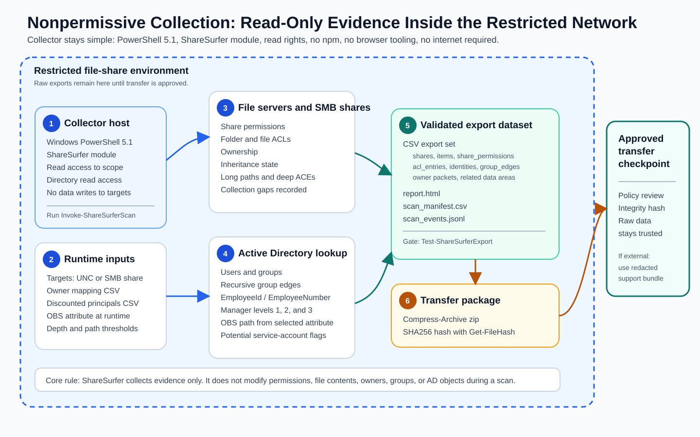
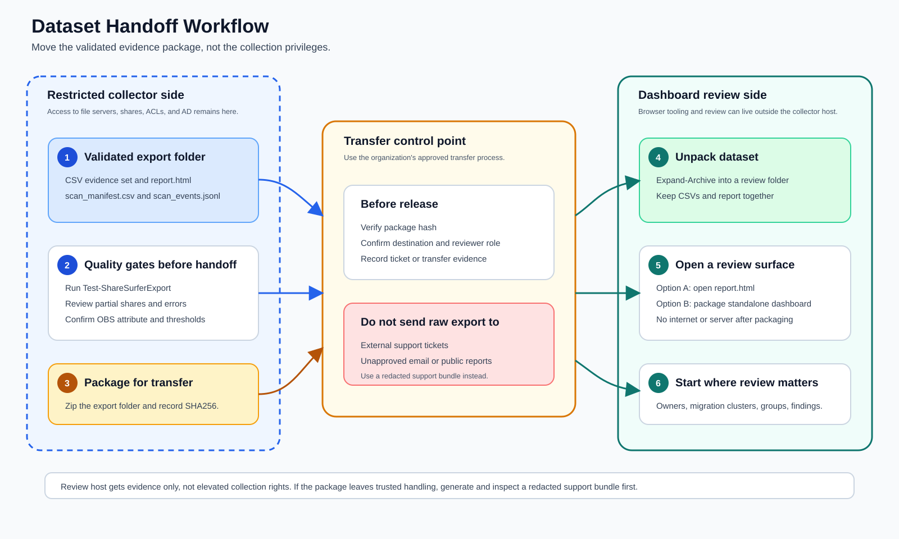

# Nonpermissive Collector to Dashboard Host Workflow

Use this workflow when the file-share environment is locked down, but reviewers need a richer dashboard experience on another workstation. The collector can stay simple and restricted. The dashboard host can be more permissive.



## When To Use This

Use this pattern when:

- The collector host has access to file servers, SMB shares, NTFS ACLs, and Active Directory, but has no internet access.
- The collector host cannot install Node, browser tooling, Power BI, or other review tools.
- Raw scan evidence must remain inside a trusted boundary until it is approved for transfer.
- A separate analyst or business-review workstation can open the dashboard package.

ShareSurfer does not change permissions. It reads evidence, writes normalized CSVs, and produces an offline report or dashboard package.

## Host Roles

| Host | What it needs | What it creates |
| --- | --- | --- |
| Collector host | Windows PowerShell 5.1, ShareSurfer module, read access to target shares and directory data | Raw CSV export set, `scan_manifest.csv`, `report.html`, optional transfer package |
| Dashboard host | Browser and the unpacked ShareSurfer release package | Offline dashboard review folder copied from the export dataset |

The collector host does not need npm, Vite, Playwright, internet access, or a local web server. Release users also do not need Node, npm, Vite, a development server, or internet access on the dashboard host to package and open the standalone dashboard. Download `ShareSurfer-0.1.0-pre.33.zip` and `ShareSurfer-0.1.0-pre.33.zip.sha256` from the [ShareSurfer Releases page](https://github.com/jonathanweinberg/ShareSurfer/releases) on an approved connected workstation, verify or record the hash, and move the release package by your approved process. If the checkpoint tag is not visible yet, use the latest published prerelease until `v0.1.0-pre.33` appears.

When the release ZIP is extracted to `C:\`, the ShareSurfer folder is:

```text
C:\ShareSurfer-0.1.0-pre.33\
```

If Windows Explorer suggests extracting to `C:\ShareSurfer-0.1.0-pre.33`, change the destination to `C:\` to avoid a doubled nested folder. The dashboard host can use the same release folder path, or another local path such as `D:\Tools\ShareSurfer-0.1.0-pre.33`.

During collection, `Invoke-ShareSurferScan` prints timestamped phase updates so the operator can tell the scan is still active. Use `-Quiet` only for scheduled automation. If WinRM/CIM is unavailable, ShareSurfer records the gap as partial share-permission evidence and continues with file/folder evidence where possible. If SMB/RPC is reachable but native security descriptor reads fail, the scan is still partial: review `NativeShareSecurityDescriptorUnavailable`, `NativeShareSecurityDescriptorParseFailed`, `NativeSecurityDescriptorReadFailed`, and `NativeSecurityDescriptorParseFailed` rows before asking owners to approve the result.

## 1. Prepare Inputs on the Collector

Create a dated export path:

```powershell
$scanId = 'scan-2026-06-08-finance'
$shareSurferRoot = 'C:\ShareSurfer-0.1.0-pre.33'
$exportPath = "C:\ShareSurfer\exports\$scanId"
$inputRoot = 'C:\ShareSurfer\inputs'
$ownerMappingPath = Join-Path $inputRoot 'owner-mapping.csv'
$ownershipSourcePath = Join-Path $inputRoot 'hr-obs.csv'
$ownershipEnrichmentPath = Join-Path $inputRoot 'ownership-enrichment.csv'
$ownershipDefinitionPath = Join-Path $inputRoot 'ownership-import.definition.json'
$ownershipRerunPath = Join-Path $inputRoot 'ownership-enrichment-rerun.ps1'
$discountedPrincipalPath = Join-Path $inputRoot 'discounted-principals.csv'

Test-Path "$shareSurferRoot\src\ShareSurfer\ShareSurfer.psd1"
Test-Path "$shareSurferRoot\interface\standalone-dashboard\dist\index.html"
Get-ChildItem -Path "$shareSurferRoot\*" -Recurse -File -Include *.ps1,*.psm1,*.psd1 | Unblock-File

New-Item -ItemType Directory -Path $exportPath -Force
New-Item -ItemType Directory -Path $inputRoot -Force
```

The `Unblock-File` line clears the Windows downloaded-file block from ShareSurfer PowerShell files. It is safe to run again after re-extracting or re-copying the release folder.

Both `Test-Path` commands should return `True`. If either returns `False`, confirm the ZIP was extracted to the expected folder before scanning.

Create an owner mapping CSV when you know the expected business owner:

```powershell
@(
  [pscustomobject]@{
    Pattern = '\\files01\Finance\*'
    Owner = 'Finance Operations'
    BusinessUnit = 'Finance'
    Source = 'operator'
  }
) | Export-Csv -LiteralPath $ownerMappingPath -NoTypeInformation -Encoding UTF8
```

Create a discounted principals CSV when broad HelpDesk, admin, scanner, backup, or platform groups should stay visible but should not drive Migration Discovery relatedness:

```powershell
@(
  [pscustomobject]@{
    Identity = 'CONTOSO\HelpDeskOps'
    Reason = 'Broad HelpDesk access'
    Scope = 'Global'
  }
) | Export-Csv -LiteralPath $discountedPrincipalPath -NoTypeInformation -Encoding UTF8
```

Discounted does not mean ignored, safe, approved, or remediated. ShareSurfer still shows the access in the CSVs and report.

If HR, employee, OBS, project, or owner CSVs are available before the scan, normalize them on the collector while it can still read AD. The simplest locked-down pattern is to place the first candidate file at `C:\ShareSurfer\inputs\hr-obs.csv`; use the full admin ownership import guide when several CSVs need to be selected with the text picker.

```powershell
if (Test-Path -LiteralPath $ownershipSourcePath) {
  Import-Module "$shareSurferRoot\src\ShareSurfer\ShareSurfer.psd1" -Force

  Join-ShareSurferOwnershipSources `
    -Path $ownershipSourcePath `
    -OutputPath $ownershipEnrichmentPath `
    -DefinitionPath $ownershipDefinitionPath `
    -ObsAttribute 'extensionAttribute10' `
    -AdLookupMode Auto `
    -ForbiddenOu @('OU=Service Accounts,DC=contoso,DC=com', 'OU=Admins,DC=contoso,DC=com') `
    -ReusableCommandPath $ownershipRerunPath `
    -Force
}
```

This uses employee ID or employee number values from the CSV to gather matching AD data when directory lookup is allowed, fills available account, mail, title, office, manager, and OBS fields, and writes `ownership-enrichment.csv` for the scan. The definition JSON and rerun script make the same import repeatable after a refreshed HR/OBS file arrives. If your environment stores OBS outside `extensionAttribute10`, change `-ObsAttribute` before running this command.

## 2. Run Collection Read-Only

Import the module:

```powershell
Import-Module "$shareSurferRoot\src\ShareSurfer\ShareSurfer.psd1" -Force
```

Run the scan:

```powershell
$scanParams = @{
  TargetPath = '\\files01\Finance'
  OutputPath = $exportPath
  OperationalPathLengthThreshold = 256
  ExplicitAceDepthThreshold = 2
  GroupExpansionMaxDepth = 5
  ManagerIdentityFormat = 'MailTo'
  AdLookupMode = 'Auto'
  ObsAttribute = 'extensionAttribute10'
}

if (Test-Path -LiteralPath $ownerMappingPath) {
  $scanParams.OwnerMappingPath = $ownerMappingPath
}

if (Test-Path -LiteralPath $ownershipEnrichmentPath) {
  $scanParams.OwnershipEnrichmentPath = $ownershipEnrichmentPath
}

if (Test-Path -LiteralPath $discountedPrincipalPath) {
  $scanParams.DiscountedPrincipalPath = $discountedPrincipalPath
}

Invoke-ShareSurferScan @scanParams
```

Use the correct `-ObsAttribute` for your directory. `extensionAttribute10` is the default, but some environments use another attribute such as `info`.

Do not pass optional input paths unless the files exist. The splatted command above checks for the owner mapping, ownership enrichment, and discounted principals CSVs before adding those parameters, so a first scan can still run without optional inputs.

Optional: record open-file activity before packaging the dataset. This helps reviewers see hot folders that were active during a migration or owner-review window. A one-sample run is good for an ad hoc check:

```powershell
Invoke-ShareSurferOpenFileAssessment `
  -ComputerName 'files01' `
  -ShareName 'Finance' `
  -OutputPath $exportPath `
  -SampleCount 1
```

For longer collection, run the same command from Task Scheduler under the collector account and use a dated `$exportPath`, or intentionally replace prior open-file assessment files with `-Force`. The command adds optional `open_file_manifest.csv`, `open_file_samples.csv`, `open_file_summary.csv`, and `open_file_errors.csv` files. Those files transfer with the rest of the export folder and are imported by the report/dashboard when present.

Validate the export:

```powershell
$validation = Test-ShareSurferExport -ExportPath $exportPath
$validation
```

Generate the default offline report on the collector:

```powershell
ConvertTo-ShareSurferReport -ExportPath $exportPath -OutputPath "$exportPath\report.html"
```

At this point the export folder is the dataset. Keep it together.

Collector handoff checklist:

- `Test-ShareSurferExport` returned `IsValid=True`, or the validation failure is documented before transfer.
- `scan_manifest.csv`, `evidence_confidence.csv`, `shares.csv`, `items.csv`, `share_permissions.csv`, `acl_entries.csv`, `findings.csv`, `conflicts.csv`, `collection_errors.csv`, and `scan_events.csv` are present.
- `report.html` exists in the export folder.
- `evidence_confidence.csv` has no unresolved stop gates for the intended review scope, or the gap is documented before transfer.
- `shares.csv` partial rows and `collection_errors.csv` critical rows have been reviewed by the operator.
- `owner_review_packets.csv` and `owner_risk_pivots.csv` are present when owner mapping was supplied.
- Optional `open_file_*.csv` files are present when open-file activity was collected.
- Raw exports are approved for the intended transfer path, or a redacted support bundle will be used instead.

## 3. Package the Dataset for Transfer

Create a zip package and hash:

```powershell
$packageRoot = 'C:\ShareSurfer\packages'
if (-not (Test-Path -LiteralPath $packageRoot)) {
  Write-Host "Creating missing local handoff package folder: $packageRoot"
  New-Item -ItemType Directory -Path $packageRoot -Force | Out-Null
}

$zipPath = Join-Path $packageRoot "$scanId.zip"
if (Test-Path -LiteralPath $zipPath) {
  Remove-Item -LiteralPath $zipPath -Force
}

Compress-Archive -LiteralPath (Join-Path $exportPath '*') -DestinationPath $zipPath
Get-FileHash -LiteralPath $zipPath -Algorithm SHA256 |
  Export-Csv -LiteralPath "$zipPath.sha256.csv" -NoTypeInformation -Encoding UTF8
```

Move the zip and hash file by your approved transfer process. Examples include an approved file-transfer service, a controlled jump host, removable media governed by policy, or another internal process your organization already trusts.

Do not send raw exports outside the trusted boundary unless your organization has approved that. Raw exports can contain real names, paths, server names, business-unit names, employee identifiers, manager chains, and OBS values.

## 4. Open on the Dashboard Host



Unpack the dataset:

```powershell
$reviewRoot = 'D:\ShareSurfer\reviews\scan-2026-06-08-finance'
New-Item -ItemType Directory -Path $reviewRoot -Force
Expand-Archive -LiteralPath 'D:\Intake\scan-2026-06-08-finance.zip' -DestinationPath $reviewRoot
```

Confirm the package hash when your transfer process provides the collector-side hash CSV:

```powershell
$zipPath = 'D:\Intake\scan-2026-06-08-finance.zip'
$hashCsvPath = 'D:\Intake\scan-2026-06-08-finance.zip.sha256.csv'
$expectedHash = (Import-Csv -LiteralPath $hashCsvPath | Select-Object -First 1).Hash
$actualHash = (Get-FileHash -LiteralPath $zipPath -Algorithm SHA256).Hash

$actualHash -eq $expectedHash
```

The final line should return `True`. If it returns `False`, stop and re-check the transfer before opening or repackaging the dataset.

Open the default report:

```powershell
Start-Process (Join-Path $reviewRoot 'report.html')
```

Dashboard host received-package checklist:

- The received zip hash matches the hash recorded on the collector side.
- The extracted folder contains `scan_manifest.csv` at the top level, not another nested zip or release package folder.
- `report.html` opens from the extracted review folder.
- The ShareSurfer release folder is separate from the scan export folder. The release contains the dashboard template assets; the export folder contains the scan data.
- If the standalone dashboard opens a template/onboarding screen, run `New-ShareSurferStandaloneDashboard.ps1` against the extracted export folder and open the generated dashboard output instead.

If you are using the `v0.1.0-pre.33` release package, or the latest published prerelease while waiting for the checkpoint tag to appear, the standalone dashboard assets are already built. Package the dataset into a self-contained dashboard folder:

```powershell
$shareSurferRoot = 'D:\Tools\ShareSurfer-0.1.0-pre.33'

powershell.exe -NoLogo -NoProfile -ExecutionPolicy Bypass -File "$shareSurferRoot\scripts\New-ShareSurferStandaloneDashboard.ps1" `
  -ExportPath $reviewRoot `
  -OutputPath "$reviewRoot\standalone-dashboard" `
  -Force
```

Open:

```powershell
Start-Process "$reviewRoot\standalone-dashboard\index.html"
```

The standalone dashboard folder is static. After packaging, it opens from disk and does not need npm, Vite, a server, or internet access. The release's `interface\standalone-dashboard\dist\index.html` is only a template shell until you run `New-ShareSurferStandaloneDashboard.ps1` against a validated export.

## 5. What Reviewers Should Start With

Start with:

1. `owner_review_packets.csv` or the dashboard owner review queue.
2. `related_data_areas.csv` for migration discovery and like-owned shares/folders.
3. `permissioned_groups.csv` for groups that directly grant access.
4. `findings.csv` for long paths, broken inheritance, deep explicit ACEs, and service-account candidates.
5. `conflicts.csv` for share gate vs file/folder permission mismatches.
6. Raw evidence tables only when an operator needs the CSV-shaped detail.

For business users, frame the review around who owns the data, why it was flagged, which groups grant access, and what must be resolved before migration planning.

## 6. If You Need To Share a Support Case

Create a redacted support bundle instead of sending raw exports:

```powershell
New-ShareSurferSupportBundle `
  -ExportPath $exportPath `
  -OutputPath 'C:\ShareSurfer\support\scan-2026-06-08-finance-redacted' `
  -RedactionMode StableToken `
  -RedactionSalt 'case-2026-06-08-finance' `
  -IncludeReport
```

Validate and inspect the bundle before sharing it:

```powershell
Test-ShareSurferExport -ExportPath 'C:\ShareSurfer\support\scan-2026-06-08-finance-redacted'
```

Search for raw domain names, server names, share names, user names, group names, and business-unit names before attaching anything to a ticket.

## Quick Decision Guide

| Need | Use |
| --- | --- |
| Strict collector, no extra tooling | Run `Invoke-ShareSurferScan`, `Test-ShareSurferExport`, and `ConvertTo-ShareSurferReport` on the collector. |
| Rich review on another host | Transfer the validated export folder or zip to the dashboard host. |
| Dashboard host uses `v0.1.0-pre.33` or the latest published prerelease zip | Run `New-ShareSurferStandaloneDashboard.ps1` against the transferred export; no npm or Vite is required. |
| External bug report or support case | Generate a redacted support bundle and inspect it before sharing. |
