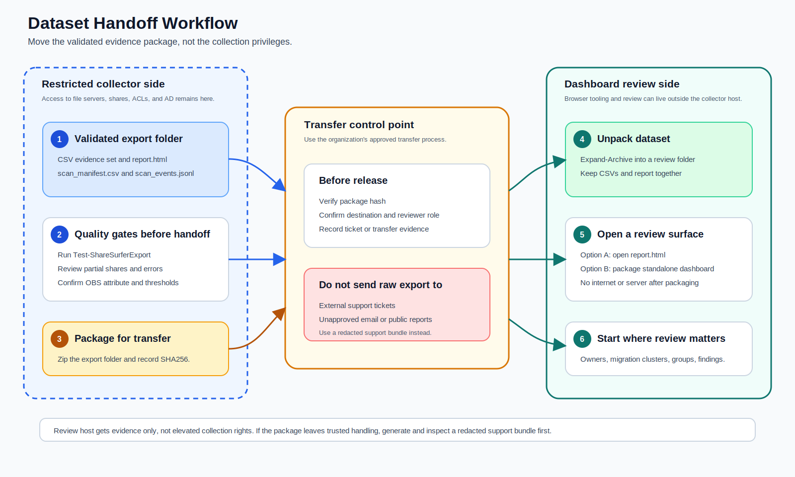

# ShareSurfer V1 Operator Workflow

ShareSurfer V1 is a Windows PowerShell 5.1-only collector for SMB share discovery, ACL collection, identity enrichment, normalized CSV export, and offline reporting. It is designed for Windows SMB shares and can make a best-effort pass over Samba-style SMB shares when the operator can enumerate paths and permissions from the Windows host.

If this is your first time using ShareSurfer, start with the [First-run guide](first-run-guide.md). It walks through prerequisites, choosing scan targets, running the collector, understanding outputs, generating reports, creating redacted support bundles, and next actions in beginner-friendly language.

## Scope

- Primary target: Windows file servers and Windows SMB shares.
- Secondary target: Samba-style SMB shares, best effort only. Expect partial owner, ACL, share-permission, or identity data when Windows APIs cannot read equivalent Samba metadata.
- Runtime: Windows PowerShell 5.1. Do not assume PowerShell 7 behavior.
- Output: a normalized CSV export set plus an optional static report and redacted support bundle.

## Prerequisites

- Run from an account that can enumerate target shares, files, folders, NTFS ACLs, and share permissions.
- Use an account with directory read access when identity, group, manager-chain, employee, or OBS enrichment is required.
- Pick a local output directory with enough free space for CSVs and any support bundle.
- Record the OBS extension attribute in use, for example `extensionAttribute10`, before scanning. If that attribute is not present in the AD schema, use another attribute that exists on both users and groups, such as `info`.

## Choose Your Operator Path

| Goal | Start here | Skip for now |
| --- | --- | --- |
| First production scan | [Scan Workflow](#scan-workflow), then `Test-ShareSurferExport`, report generation, and [First-run troubleshooting](first-run-troubleshooting.md) if anything looks partial. | Lab creation and enterprise validation. |
| Locked-down collector with separate review workstation | [Nonpermissive Collector to Dashboard Host](#nonpermissive-collector-to-dashboard-host). | Dashboard development tooling. |
| Business-owner review | `owner_review_packets.csv`, `owner_risk_pivots.csv`, `related_data_areas.csv`, and the report What Needs Review First queue. | Raw evidence tables until an operator needs detail. |
| Enterprise lab proof | [Lab Setup](#lab-setup), [Windows lab readiness checklist](windows-lab-readiness-checklist.md), then acceptance validation. | Production shares. |
| Support case | Validate the raw export first, then create and inspect a redacted support bundle. | Sending raw CSVs outside trusted handling. |

Production-only operators can skip the lab setup section until they need to validate a new build, demo environment, or enterprise-scale proof run.

## Lab Setup

Use the lab fixture in a disposable lab before touching production shares.

```powershell
$labRoot = 'C:\ShareSurferLab'
New-ShareSurferLabFixture -OutputPlanOnly -RootPath $labRoot -DomainNetBiosName 'CONTOSO' -ObsAttribute 'extensionAttribute10'
```

Review the plan first. When the plan is acceptable and the lab is disposable, rerun without `-OutputPlanOnly`.

For enterprise-scale validation, plan the larger profile before creating anything:

```powershell
$labRoot = 'C:\ShareSurferEnterpriseLab'
New-ShareSurferLabFixture `
  -OutputPlanOnly `
  -RootPath $labRoot `
  -DomainNetBiosName 'CONTOSO' `
  -ObsAttribute 'extensionAttribute10' `
  -Scale Enterprise `
  -EnterpriseUserCount 2500 `
  -EnterpriseShareCount 250 `
  -EnterpriseFilesPerShare 8 `
  -MaxLabBytes 2147483648
```

The V1 fixture is expected to create:

- AD users, groups, nested group membership, manager chains, and OBS extension attributes.
- SMB shares, files, and folders.
- Directory ACLs, file-specific ACLs, and ownership examples.
- Inheritance breaks, deep explicit ACEs, and NTFS deny examples.
- Long path fixtures.
- Share-vs-NTFS permission conflicts.

The enterprise profile must additionally prove:

- A multi-thousand user population.
- Hundreds of SMB shares.
- Deep share trees and intricate folder paths.
- Real file objects throughout the trees, using small file contents.
- Owner/business-unit mappings and generated owner-risk pivot rows.
- Estimated generated lab data under the default 2 GiB file-data budget. The 8 GiB ceiling is reserved for explicit stress runs.

See [Scaled lab generator spec](scaled-lab-generator-spec.md) for the enterprise defaults, count formulas, disk-budget math, and plan/live acceptance criteria. Before running the live enterprise validation, use the [Windows lab readiness checklist](windows-lab-readiness-checklist.md) to confirm host prerequisites, permissions, disk budget, preflight gates, and expected evidence artifacts.

For a repeatable Windows Server validation run, use the script from the repository root:

```powershell
.\scripts\Invoke-ShareSurferLabValidation.ps1 `
  -CreateLab `
  -LabRoot 'C:\ShareSurferLab' `
  -OutputRoot 'C:\ShareSurfer\lab-validation' `
  -DomainNetBiosName 'CONTOSO' `
  -ObsAttribute 'extensionAttribute10' `
  -IncludeFiles
```

For the enterprise profile, add:

```powershell
  -Scale Enterprise `
  -EnterpriseUserCount 2500 `
  -EnterpriseShareCount 250 `
  -EnterpriseFilesPerShare 8 `
  -RequireLiveEvidence
```

Before creating an enterprise lab, run the same command with `-PreflightOnly -CreateLab`. The `-CreateLab` switch tells preflight to check creation blockers such as target-volume free space, AD name collisions, and SMB share path collisions. `-PreflightOnly` still stops before creating AD objects, SMB shares, files, reports, scans, or support bundles.

```powershell
.\scripts\Invoke-ShareSurferLabValidation.ps1 `
  -PreflightOnly `
  -CreateLab `
  -LabRoot 'C:\ShareSurferLab' `
  -OutputRoot 'C:\ShareSurfer\lab-validation' `
  -DomainNetBiosName 'CONTOSO' `
  -ObsAttribute 'extensionAttribute10' `
  -Scale Enterprise `
  -EnterpriseUserCount 2500 `
  -EnterpriseShareCount 250 `
  -EnterpriseFilesPerShare 8 `
  -IncludeFiles `
  -RequireLiveEvidence
```

Use the returned `PreflightPath` to open `lab-preflight.csv`. Fix any `Blocker` rows before rerunning with `-CreateLab`.

The script writes `lab-plan.json`, `owner-mapping.csv`, `collector-environment.json`, `lab-preflight.csv`, `lab-run-events.jsonl`, `validation.json`, `lab-validation-criteria.csv`, `live-evidence.json`, `live-evidence-review.csv`, `v1-acceptance.json`, `v1-acceptance-summary.json`, `dashboard-review.md`, `issue-summary.md`, `validation-closeout-checklist.md`, issue-specific Markdown files under `issue-comments`, `issue-comment-publish-preview.csv`, normalized CSVs, and `report.html`. Use `-IncludeRedactedSupportBundle` when you also want the lab runner to create the richer redacted lab-run support bundle; phase-1 enterprise proof does not require that optional bundle. The raw `lab-run-events.jsonl` file is the trusted internal phase log for seeing where a run stopped. Open `v1-acceptance-summary.json` first for a quick pass/fail view with check names and counts; use `v1-acceptance.json` when you need the detailed evidence. Use `collector-environment.json` to confirm the collector host, PowerShell version, modules, and commands that were available when the run started. Use `dashboard-review.md` to confirm the dashboard marker checks passed and to guide the operator review of the live report views. Use `validation-closeout-checklist.md` to decide whether the run is ready for proof review, use `issue-summary.md` as the starting point for public-safe GitHub issue updates, then use the `issue-comments` folder for targeted body-file comments for issues #1, #3, #5, and #6. When `-IncludeRedactedSupportBundle` is used, the redacted bundle includes redacted lab-run diagnostics such as `lab_run_diagnostics.json`, `lab_run_events.jsonl`, `collector_environment.json`, `lab_preflight.csv`, `lab_validation_criteria.csv`, `live_evidence_review.csv`, `live_evidence.json`, `v1_acceptance.json`, `v1_acceptance_summary.json`, `dashboard_review.md`, `issue_summary.md`, `validation_closeout_checklist.md`, and sanitized `issue_comments` files so support cases can include lab status without exposing raw paths or identities. For enterprise validation, `lab-validation-criteria.csv` is the pass/fail evidence for user population, group population, employee identifier coverage, manager-chain coverage, user OBS/OID coverage, share population, real file fixtures, deep paths, long-path policy fixtures, share permissions, ACLs, scanned ownership rows, collection-error row counts, permission-bearing group OBS/OID coverage, owner-risk pivots, related data areas, owner review packets, and the configured disk budget. A clean Windows scan can show `EnterpriseCollectionErrors` with `0` rows; partial-data paths should show the collected gap count. The default generated file-data budget is 2 GiB; use `-MaxLabBytes 8589934592` only for an explicit 8 GiB stress run.

The `issue-comments` folder contains:

- `issue-1-lab-fixture-live-proof.md`
- `issue-3-scanner-live-proof.md`
- `issue-5-identity-group-live-proof.md`
- `issue-6-dashboard-live-proof.md`
- `issue-comment-manifest.csv`
- `post-commands.txt`

Review each Markdown file before posting. They summarize only safe status values, counts, criterion names, and check names. Use `issue-comment-publish-preview.csv` to confirm the generated comments are still in dry-run status before anyone posts them. Use `post-commands.txt` when you are ready to post the comments with `gh issue comment --body-file`. When the optional redacted support bundle is generated, it also includes a sanitized `issue_comments` folder with the same comment bodies, a manifest without raw run paths, a publish preview with relative body-file paths, and post commands that use relative bundle paths.

Preview the generated issue updates before posting:

```powershell
.\scripts\Publish-ShareSurferValidationIssueComments.ps1 `
  -RunRoot 'C:\ShareSurfer\lab-validation\20260604-193000'
```

Post only after you have reviewed the generated Markdown files and `validation-closeout-checklist.md` says `Ready for proof review: True`:

```powershell
.\scripts\Publish-ShareSurferValidationIssueComments.ps1 `
  -RunRoot 'C:\ShareSurfer\lab-validation\20260604-193000' `
  -Post
```

Use `-IssueNumber 1,3` when you only want to post selected proof comments. The publisher uses `gh issue comment --body-file` and reads back posted comments for verification. When `-Post` is used with `-RunRoot`, the publisher refuses to post unless the closeout checklist is ready for proof review; use `-SkipReadyCheck` only for a deliberate manual override after documenting why the run is still safe to publish.

Open `lab-preflight.csv` first if validation stops early. It checks whether the run appears to be on a Windows collector host, whether PowerShell 5.1 and the required Active Directory and SMB cmdlets are available, whether the selected `-ObsAttribute` exists and is allowed on both users and groups, whether the generated lab user password pattern fits the default domain password policy, whether planned AD user or group names already exist outside the ShareSurferLab OU, whether any planned SMB share name already points at another local path, whether the output path exists, whether an existing lab root is present when `-CreateLab` is not used, whether planned data stays under the disk budget, whether the target lab volume has enough free space for the configured byte budget before live creation, whether plan criteria are satisfiable, whether Windows path components are safe, and whether enterprise validation is scanning files.

Each criteria row includes `EvidenceSource` and `EvidenceDetail`. Prefer rows backed by live evidence such as `ActiveDirectory`, `ScanExport:shares.csv`, `ScanExport:share_permissions.csv`, `ScanExport:items.csv`, `ScanExport:acl_entries.csv`, `ScanExport:collection_errors.csv`, `ScanExport:identities.csv`, `ScanExport:org_chains.csv`, `ScanExport:findings.csv`, `ScanExport:conflicts.csv`, `ScanExport:group_edges.csv`, `ScanExport:owner_risk_pivots.csv`, `ScanExport:related_data_areas.csv`, `ScanExport:owner_review_packets.csv`, or `FileSystem`. `LabPlan` rows are useful for planning, but they are not enough by themselves for final enterprise-scale proof. The real-file criterion also reads `ScanExport:scan_manifest.csv`; if scanned file rows disagree with `IncludeFiles`, the criterion reports `ScanExportMismatch:scan_manifest.csv` so the operator can rerun the scan instead of trusting stale evidence. `-RequireLiveEvidence` makes this strict: the run fails if any required enterprise criterion is still backed only by the lab plan, blank evidence, or unavailable directory evidence. Open `live-evidence.json` for the machine-readable gate result and `live-evidence-review.csv` for the operator checklist with evidence status and next actions.

After the run finishes, validate the complete evidence package. Use the timestamped run folder created under `-OutputRoot`:

```powershell
.\scripts\Test-ShareSurferV1Acceptance.ps1 `
  -RunRoot 'C:\ShareSurfer\lab-validation\20260604-193000' `
  -RequireLiveEvidence
```

This checks the normalized CSV export set, `scan_manifest.csv` file-scan evidence, `owner_review_packets.csv`, raw `scan_events.jsonl`, offline `report.html`, dashboard review evidence, collector environment evidence, raw issue-comment artifacts, the raw dry-run issue-comment publish preview, raw validation closeout checklist, `lab-preflight.csv`, lab validation criteria, `live-evidence-review.csv`, and live-evidence gate. Add `-AllowMissingSupportBundle` when re-checking an enterprise proof run that intentionally skipped the optional rich lab-run support bundle. Without that switch, the checker also requires the redacted support bundle, redacted lab-run support bundle evidence, bundled validation closeout checklist, and bundled sanitized issue-comment artifacts. The scan manifest check requires `IncludeFiles=True` when `-RequireLiveEvidence` is used. The dashboard review check confirms `dashboard-review.md` exists and says the report rendered enough for operator review. The collector environment check confirms `collector-environment.json` includes host, PowerShell, module, and command context for the run. The lab validation criteria must prove the lab scale and fixtures ShareSurfer needs for enterprise proof: user, group, and share population; real file fixtures; deep paths; long-path policy fixtures; and the configured disk budget. They must prove scanner coverage for share permissions, folder ACLs, file ACLs, ownership evidence, deep explicit ACEs, inheritance breaks, share-vs-NTFS conflicts, and collection-error evidence. They must also prove the directory data ShareSurfer needs for owner review: employee identifiers, three-level manager chains when populated, the runtime OBS/OID attribute, recursive group expansion, and OBS/OID coverage on permission-bearing groups. When a support bundle is present, the redacted support bundle check reads `support_bundle_manifest.csv` and fails if bundle validation failed or if redaction leaks were reported. The closeout checklist check confirms the run has a safe go/no-go summary for proof review, including named go gates for lab population, lab fixtures, scanner permissions, scanner findings, scanner conflicts and collection errors, file-object scanning, collector environment evidence, dashboard review evidence, identity enrichment evidence, and group expansion evidence. The issue-comment checks confirm the raw body-file comments exist and the raw publish preview stayed dry-run only; bundled copies are checked when the optional bundle is generated. The preflight check fails when required readiness rows did not pass. The live evidence review check fails when required criteria are still plan-only, unavailable, missing an evidence source, or failed. The lab validation script runs this acceptance check automatically and saves the result to `v1-acceptance.json`, then writes `v1-acceptance-summary.json` with concise status counts and failing check names; rerun the command manually when you want to re-check an archived run folder.

If a `-RequireLiveEvidence` run is not ready for proof review, the lab validation script continues far enough to build the report, issue summary, issue comment drafts, and closeout checklist before returning the final failure. If `-IncludeRedactedSupportBundle` was selected, it also attempts the redacted lab-run support bundle. Open `validation-closeout-checklist.md` first, then `live-evidence-review.csv`, to see which rows need a rerun or lab fix.

If you need to reassess an archived lab run after ShareSurfer's verifier logic changes, create a separate refreshed review instead of editing the historical run files:

```powershell
.\scripts\New-ShareSurferArchivedEvidenceRefresh.ps1 `
  -RunRoot 'C:\ShareSurfer\lab-validation\20260604-193000' `
  -RequireLiveEvidence `
  -AllowMissingSupportBundle `
  -AllowMissingIssueComments
```

This writes a `refreshed-evidence` folder under the archived run. It preserves the original criteria rows and only strengthens criteria that the existing CSV export can prove with current logic. Use it for archived proof review; rerun live validation when AD, filesystem, collector, or scan evidence itself is missing.

## Scan Workflow

Use a dated export path for each run.

```powershell
$exportPath = 'C:\ShareSurfer\exports\scan-2026-06-04'
$discountedPrincipalPath = 'C:\ShareSurfer\inputs\discounted-principals.csv'

Invoke-ShareSurferScan `
  -TargetPath '\\files01\Finance' `
  -OutputPath $exportPath `
  -OwnerMappingPath 'C:\ShareSurfer\inputs\owner-mapping.csv' `
  -DiscountedPrincipalPath $discountedPrincipalPath `
  -OperationalPathLengthThreshold 256 `
  -ExplicitAceDepthThreshold 2 `
  -AdLookupMode Auto `
  -ObsAttribute 'extensionAttribute10'
```

Use `-DiscountedPrincipalPath` for broad admin, HelpDesk, scanner, backup, or platform groups that should stay visible as access evidence but should not create Migration Discovery relatedness. The CSV shape is `Identity`, optional `Reason`, and optional `Scope`. Discounted does not mean ignored, safe, or approved; `share_permissions.csv`, `acl_entries.csv`, `permissioned_groups.csv`, and the report still show the access.

The collector prints timestamped console progress by default so operators can see collection, ACL reading, identity enrichment, export, and completion phases. Use `-Quiet` for scheduled automation. WinRM/CIM gaps are treated as best-effort collection gaps when ShareSurfer can still inspect the path; review `collection_errors.csv`, `findings.csv`, and Diagnostics before approval.

If a first run looks incomplete, use [First-run troubleshooting](first-run-troubleshooting.md) before changing scan scope. That guide lists the exact CSVs to open first and separates rerun decisions from business-review handoff decisions.

When the Windows SMB cmdlets can resolve the share directly, scan by computer and share name:

```powershell
Invoke-ShareSurferScan `
  -ComputerName 'files01' `
  -ShareName 'Finance' `
  -OutputPath $exportPath `
  -IncludeFiles `
  -AdLookupMode Auto `
  -ObsAttribute 'extensionAttribute10'
```

For a remote `-ComputerName`, ShareSurfer uses a CIM session for Windows SMB share metadata and share-level permissions. If that session cannot be opened, ShareSurfer still attempts best-effort UNC enumeration and marks the share partial when it cannot prove the share-permission layer.

If a pre-collected inventory object is being tested, pass it with `-InputObject`. For production collection, use the source-selection parameters supported by the implementation and keep the same export path discipline.

Use `-AdLookupMode Auto` for normal runs. Use `ActiveDirectory` to force the AD PowerShell module path, `Ldap` to force the built-in .NET directory searcher fallback, or `DirectoryOnly` for imported fixture data where no live directory lookup should occur. Both live directory paths try to populate employee fields, title, office, the selected OBS attribute, direct manager, manager's manager, and third-level manager when directory permissions allow those reads.

## Optional Open-File Activity Assessment

Use `Invoke-ShareSurferOpenFileAssessment` when migration planning needs a simple view of which folders are actively being used. Run it after the normal scan and point it at the same export folder. The command writes optional `open_file_*.csv` files beside the normalized scan CSVs, and the report/dashboard will import them when present.

Quick ad hoc run:

```powershell
Invoke-ShareSurferOpenFileAssessment `
  -ComputerName 'files01' `
  -ShareName 'Finance' `
  -OutputPath $exportPath `
  -SampleCount 1
```

Longer observation window:

```powershell
Invoke-ShareSurferOpenFileAssessment `
  -ComputerName 'files01' `
  -ShareName 'Finance' `
  -OutputPath $exportPath `
  -SampleCount 480 `
  -IntervalSeconds 60 `
  -Force
```

The package includes `open_file_manifest.csv`, `open_file_samples.csv`, `open_file_summary.csv`, and `open_file_errors.csv`. Start with `open_file_summary.csv`; `HotFolder=True` means the folder had repeated observations, multiple users or clients, locks, or a high combined heat score. `open_file_errors.csv` records provider failures, such as missing permissions or an unavailable open-file provider, without removing the rest of the package.

For scheduled collection, use the same command in Task Scheduler under the collector account. Prefer a dated export path per run. Use `-Force` only when you intentionally want to replace the previous open-file assessment files in an existing export folder.

After every scan, validate the export set:

```powershell
Test-ShareSurferExport -ExportPath $exportPath
```

Generate the offline report:

```powershell
ConvertTo-ShareSurferReport -ExportPath $exportPath -OutputPath "$exportPath\report.html"
```

Create a support bundle only after the export validates:

```powershell
New-ShareSurferSupportBundle `
  -ExportPath $exportPath `
  -OutputPath 'C:\ShareSurfer\support\scan-2026-06-04-redacted' `
  -RedactionMode StableToken
```

## Nonpermissive Collector to Dashboard Host

Use this workflow when the collector has the privileged network position, but not the tooling or policy freedom needed for richer dashboard review.


On the collector host:

1. Import the ShareSurfer module.
2. Run `Invoke-ShareSurferScan` with the correct target, owner mapping, discounted principal list, thresholds, and `-ObsAttribute`.
3. Run `Test-ShareSurferExport`.
4. Run `ConvertTo-ShareSurferReport` so the dataset always includes the baseline offline report.
5. Package the export folder and hash the package.

```powershell
$scanId = 'scan-2026-06-04-finance'
$exportPath = "C:\ShareSurfer\exports\$scanId"
$zipPath = "C:\ShareSurfer\packages\$scanId.zip"
New-Item -ItemType Directory -Path (Split-Path -Parent $zipPath) -Force | Out-Null

if (Test-Path -LiteralPath $zipPath) {
  Remove-Item -LiteralPath $zipPath -Force
}

Compress-Archive -LiteralPath (Join-Path $exportPath '*') -DestinationPath $zipPath
Get-FileHash -LiteralPath $zipPath -Algorithm SHA256 |
  Export-Csv -LiteralPath "$zipPath.sha256.csv" -NoTypeInformation -Encoding UTF8
```

Move the zip and hash through an approved transfer process. Keep raw exports inside the trusted boundary unless the organization has approved the transfer. Raw exports can include server names, share names, full paths, identities, employee identifiers, manager chains, and OBS values.



On the dashboard host:

```powershell
$reviewRoot = 'D:\ShareSurfer\reviews\scan-2026-06-04-finance'
New-Item -ItemType Directory -Path $reviewRoot -Force
Expand-Archive -LiteralPath 'D:\Intake\scan-2026-06-04-finance.zip' -DestinationPath $reviewRoot
Start-Process (Join-Path $reviewRoot 'report.html')
```

If you are using the [v0.1.0-pre.10 release package](https://github.com/jonathanweinberg/ShareSurfer/releases/tag/v0.1.0-pre.10), the standalone dashboard assets are already built. Package the transferred export for a richer static review experience:

```powershell
powershell.exe -NoLogo -NoProfile -File .\scripts\New-ShareSurferStandaloneDashboard.ps1 `
  -ExportPath $reviewRoot `
  -OutputPath "$reviewRoot\standalone-dashboard" `
  -Force
```

The packaged standalone dashboard opens from `standalone-dashboard\index.html` and does not need npm, Vite, a server, internet access, or browser `fetch` permissions after packaging. The release's `interface\standalone-dashboard\dist\index.html` is only a template shell until you package it with a validated export.

See [Nonpermissive Collector to Dashboard Host Workflow](nonpermissive-collection-dashboard-workflow.md) for the first-time-operator version of this procedure.

## Operator Checklist

1. Confirm the scan scope, account, OBS attribute, and output path.
2. Run the lab fixture in plan mode if validating a new build or demo flow.
3. Run `Invoke-ShareSurferScan`.
4. Run `Test-ShareSurferExport`.
5. Review `findings.csv`, `conflicts.csv`, and the generated report.
6. Create a redacted support bundle if external review is needed.
7. Archive the raw export internally. Share only the redacted bundle outside the trusted team.

## Report Interpretation

Use the report dashboard as a triage guide, not as the only source of truth.

- Start in `What Needs Review First` when briefing business owners. Select a packet row to focus the Review Workbench by business unit, owner, and risk.
- `shares` and `items` show the collected scope and whether data was partial. A partial share can mean an unresolved target path, missing share-level permission proof, failed folder enumeration, or ACL read errors; check `PartialReason` and the `CollectionError` findings before treating the scan as complete.
- `share_permissions` and `acl_entries` show the two permission layers that determine effective access.
- Use the Access Model view to compare the share gate with file/folder permissions in one place. A share-level permission is the front gate; folder and file ACLs decide what happens after someone gets through that gate.
- `conflicts` highlight mismatches such as NTFS identities that are not granted through the share gate.
- `findings` highlight migration and governance risks such as broken inheritance, deep explicit ACEs, and long paths.
- `scan_events` records collection and export events, including partial-data and collection-error context.
- `identities`, `group_edges`, and `org_chains` explain who an identity is, how group access expands, where the owner sits in the organization, and which user accounts may be service-account candidates because OBS and employee identifiers are missing.
- Start with the executive summary, What Needs Review First queue, Review Workbench, Access Model, Migration Discovery, Direct Access Review table, priority actions, and dashboard filters, then use finding, conflict, owner, and org-chain rollups to identify the business unit or manager area that needs attention.
- Use Migration Discovery before migration planning to find shares, folders, and files that appear to belong together. The hybrid view is a single ranked list with top filters for Relationship Signals and Readiness Signals. Adaptive Rows show Progressive Chips with the Core Five: confidence, relationship summary, migration readiness, discounted access count, and evidence completeness. Expanding a row shows all relationship/readiness signal chips plus a short related-because sentence. The selected Related Data Area detail uses Narrative Plus Evidence Blocks for cluster summary, relationship evidence, readiness review, visible-but-discounted access principals, and raw evidence shortcuts.
- Readiness or risk signals such as long paths, conflicts, broken inheritance, deep explicit ACEs, and partial data affect review priority and migration readiness, but they do not create relatedness by themselves. Planning state such as owner confirmed, cleanup needed, rerun needed, or migration candidate is a later roadmap feature, not current scan output.
- Use the business-unit, data-owner, and review-risk filters to narrow mapped findings and conflicts before sending review queues to business owners.
- Use the visual risk rollups to quickly filter the dashboard by finding type, conflict type, owner, or business unit before opening the detailed rows.
- Use the Permissioned Group Review when a security group is assigned rights. Select a group row to focus the Group Browser on that expanded membership path.
- Use Raw Evidence Tables when an operator needs to inspect the normalized CSV-shaped evidence inside `report.html`. Keep it secondary to the guided review views for business-owner conversations.

Owner mapping CSVs should include `Pattern`, `Owner`, `BusinessUnit`, and optional `Source` columns. Patterns support simple wildcards, for example `\\files01\Finance*`.

Path findings need careful wording. Microsoft documents Azure Files limits of 255-character path components and 2,048-character full paths. ShareSurfer's default warning for full paths over 256 characters is an operational migration policy, not the Azure Files hard full-path limit.
