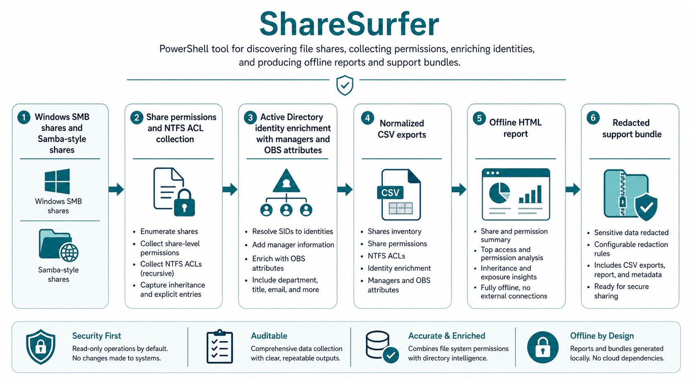
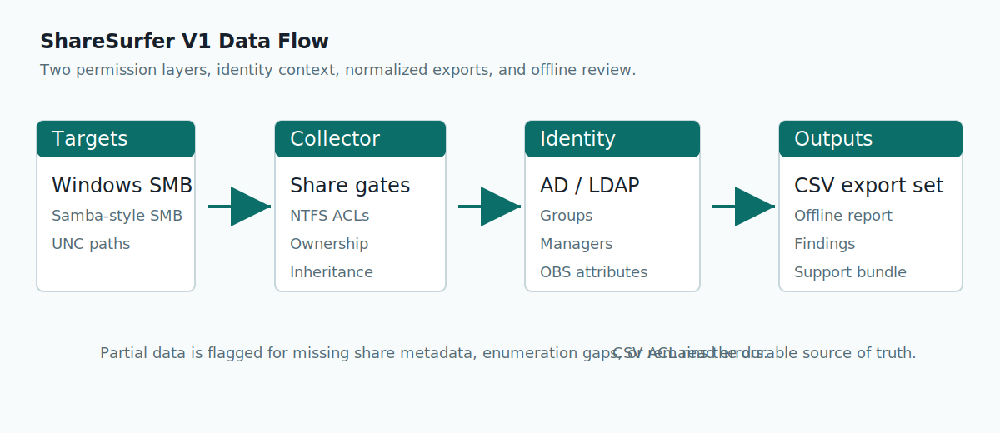
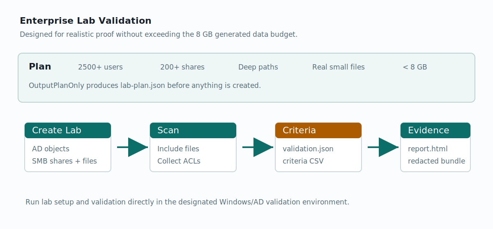
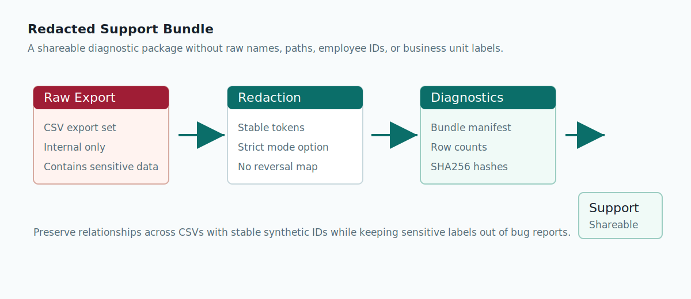

# ShareSurfer Workflow Visuals

This page gives operators and business reviewers a visual map of the V1 workflow. The committed visuals are intentionally plain, offline, and airgap-friendly.

## Workflow Overview

## Collector To Report

Use this visual when explaining how raw Windows and Samba-style share data becomes normalized CSVs and an offline report.

## Enterprise Lab Validation

Use this visual when planning the scaled Windows/AD lab run. The validation criteria must prove multi-thousand users, hundreds of SMB shares, deep paths with real files, and less than 8 GB of generated lab file data.

## Redacted Support Bundle

Use this visual when explaining what can be shared outside the trusted team. Raw exports stay internal; redacted CSVs, bundle manifests, row counts, and hashes can be attached to support cases.

## Management Overview

Use [management-overview.html](management-overview.html) when briefing non-technical leaders. It is a high-level management overview slide that explains purpose, business value, migration-risk findings, owner/business-unit pivots, and expected outcomes without requiring Windows or AD expertise.
